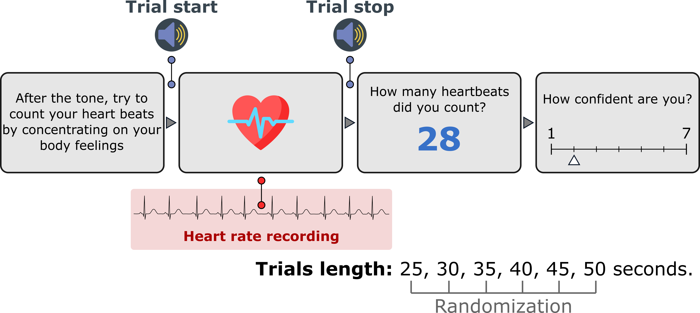
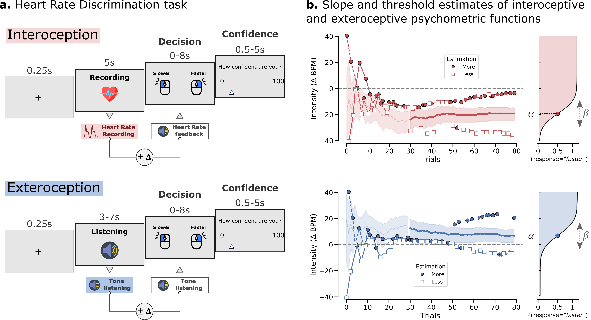

# Cardioception

The Cardioception Python Package - Measuring Interoception with Psychopy - implements three measures of cardiac interoception (cardioception):
1. The *Heartbeat counting task* developed by Rainer Schandry1,2
2. The *Heartbeat Discrimination task*
3. a novel *Heart Rate Discrimination Task* implementing an adaptive psychophysical measure for measuring cardioception.

Currently the toolbox natively supports the [Nonin 3012LP Xpod USB pulse oximeter](https://www.nonin.com/products/xpod/) together with [Nonin 8000SM 'soft-clip' fingertip sensors](https://www.nonin.com/products/8000s/). These devices are fairly cheap and readily available, however in time the intention is to support more sensors and modalities (e.g., ECG).  

# Installation

We recommend to use the last install of Anaconda for Python 3.5 or latest.

The following packages should be installed:

* [Psychopy](https://www.psychopy.org/) can be installed using `pip install psychopy` in the command line.

* [Systole](https://systole-docs.github.io/) can be install with `pip install systole` in the command line.

Download the repository as zip archive and extract the files.

If you run the task in behavioral mode, the **Nonin pulse oximeter** will be automatically detected and launched. The Heart Rate Discrimination task also include an fMRI version that can access pulse oximetry for BrainVision amplifier through a TCP/IP connection. These components might be adapted depending on your local configuration.

Notes: Cardioception will automatically copy the images and sound files necessary to run the task correctly (~ 200 Mo). These files will be removed if you uninstall the package using `pip uninstall cardioception`.

# Tasks

## Heart Beat Counting

To run the Heart Rate Discrimination Task, run:
`pyton [path]/cardioception/HeartBeatCounting/run.py`
Where `path` is the path to your install folder.

This module is an implementation of the classic "heartbeat counting task" (HCT)1,2 in which participants attend to their heartbeats in intervals of various length. Afterwards the participant indicates the number of counted heartbeats and a score is computed to represent their accuracy. In the original version1, the task started with a resting period of 60 seconds and consisted in three estimation session (25, 35 and 45 seconds) interleaved with resting periods of 30 seconds in the following order:

By default, this task implement the version used in recent publications 3 in which a training trial of 20s is proposed, after which the 6 experimental trials of different time-windows (25, 30, 35,40, 45 and 50s) occurred in a randomized order. The trial length, the condition ('Rest', 'Count', 'Training') and the randomization can be controlled in the parameters dictionary.

**The instructions are the following:**

>Without manually checking can you silently count each heartbeat you feel in your body from the time you hear the first tone to when you hear the second tone.

**The accuracy score is calculated using the following equation:**

The interoceptive accuracy score is computed using the formula proposed by Hart et al.4 as follow:

After each counting response, the participant is prompted to rate their subjective confidence (from 0 to 100), used to calculate "interoceptive awareness", i.e. the relationship of confidence and accuracy. Total task runtime using default settings is approximately **4 minutes**.

## Heartbeat Discrimination

## Heart Rate Discrimination

This task implements an adaptive psychophysical procedure for estimating participant ability to discriminate their own heart-rate. On each trial, participants attend to their heartbeat sensations for five seconds and estimate their average heartrate. Immediately following this period, a cardiac feedback stimulus of 5 tones (xx hz) is played at a particular BPM frequency. The frequency is determined as their estimate average BPM plus or minus an absolute 'alpha' value. This value is the relative difference in frequency between their true heartrate and the feedback stimulus, and is estimated across trials using an adaptive procedure.

Note that currently, the task implements a 1 up 2 down adaptive staircasing, using a logarithmic stepsize function. Using the parameters object, you can set various settings such as step criterion and size, trial numbers, and a boolean flag to collect confidence ratings or not. Future versions will implement a Bayesian Adaptive Procedure to more efficiently estimate psychometric parameters such as slope and threshold.

To run the Heart Rate Discrimination Task, run:
`python [path]/cardioception/HeartRateDiscrimination/[your task]/run.py`
Where `path` is the path to your install folder.

# Analyses

By default, the results will be saved in the `data` folder contained in each task folder.

Each folder also include an `Analyses.ipynb` file documenting the recommended analyses that can be used to generate reports.

# References

1. Dale, A., & Anderson, D. (1978). Information Variables in Voluntary Control and Classical Conditioning of Heart Rate: Field Dependence and Heart-Rate Perception. Perceptual and Motor Skills, 47(1), 79–85. https://doi.org/10.2466/pms.1978.47.1.79

2. Schandry, R. (1981). Heart Beat Perception and Emotional Experience. Psychophysiology, 18(4), 483–488. https://doi.org/10.1111/j.1469-8986.1981.tb02486.x

3. Leganes-Fonteneau, M., Cheang, Y., Lam, Y., Garfinkel, S., & Duka, T. (2019). Interoceptive awareness is associated with acute alcohol-induced changes in subjective effects. Pharmacology Biochemistry and Behavior, 181, 69–76. https://doi.org/10.1016/j.pbb.2019.03.007

4. Hart, N., McGowan, J., Minati, L., & Critchley, H. D. (2013). Emotional Regulation and Bodily Sensation: Interoceptive Awareness Is Intact in Borderline Personality Disorder. Journal of Personality Disorders, 27(4), 506–518. https://doi.org/10.1521/pedi_2012_26_049

# Credit
Some icons used in the Figures or presented during the tasks were downloaded from **Flaticon** [www.flaticon.com](www.flaticon.com).
