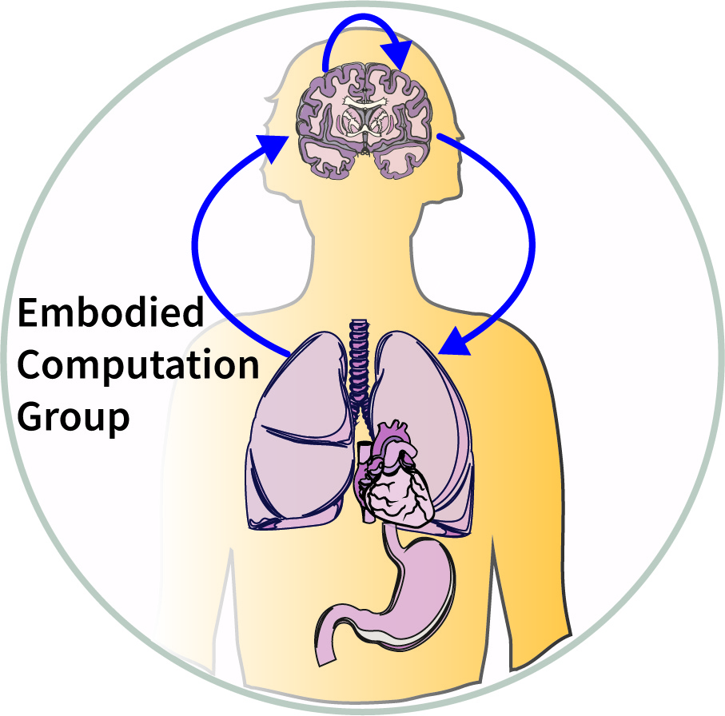
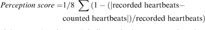

# Cardioception

Cardioception Python Package - Measuring Interoception with Psychopy. This package implements two   measures of cardiac interoception (cardioception): 1) the classical 'heartbeat counting task' by developed by Rainer Schandry<sup>1,2</sup>, and 2) a novel "Heartrate Discrimination Task" implementing an adaptive psychophysical measure for measuring cardioception. See *Tasks* below for more details of each individual method. Currently the toolbox natively supports the [Nonin 3012LP Xpod USB pulse oximeter](https://www.nonin.com/products/xpod/) together with [Nonin 8000SM 'soft-clip' fingertip sensors](https://www.nonin.com/products/8000s/). These devices are fairly cheap and readily available, however in time the intention is to support more sensors and modalities (e.g., ECG).  

# Installation

Download the repository as zip archive and extract the files.

Using a terminal, go to the folder and run:
`python setup.py install`

The **Nonin pulse oximeter** will be automatically launched from the device port specified in the `parameters.py` file of each project. The following lines might be adapted depending on your local configuration.

```python
# Open seral port for Oximeter
parameters['serial'] = serial.Serial('COM4',
                                     baudrate=9600,
                                     timeout=1/75,
                                     stopbits=1,
                                     parity=serial.PARITY_NONE)
```
Where `COM4` refers to the USB port to open.

# Tasks

By default, the results will be saved in the `Results` folder contained in each task folder. This can be modified by changing the value of the `path` entry of the parameters dictionary.

## Heart Beat Counting
[//]: # (nicolas, maybe we can add a figure for each task?)
To run the Heart Rate Discrimination Task, run:
`pyton [path]/cardioception/HeartBeatCounting/run.py`
Where `path` is the path to your install folder.

This module implements the classic "heartbeat counting task" (HCT)<sup>1,2</sup> in which participants attend to their heartbeats in intervals of 30, 45, or 60 seconds. Each interval is repeated XX times, and afterwards the participant indicates the number of counted heartbeats. The accuracy score is calculated using Equation 1:




This yields an accuracy score bounded between 0-1. After each counting response, the participant is prompted to rate their subjective confidence (from 0 to 100), used to calculate "interoceptive awareness", i.e. the relationship of confidence and accuracy. Total task runtime using default settings is approximetely XX minutes.

## Heart Rate Discrimination
[//]: # (maybe we can add a figure for each task? - ma)
[//]: # (can you add a brief description of the task and I can edit?- ma)
[//]: # (I think we should add some brief description of the options in the parameters file, similar to a matlab inline function documentation- ma)

This task implements an adaptive psychophysical procedure for estimating participant ability to discriminate their own heart-rate. On each trial, participants attend to their heartbeat sensations for five seconds and estimate their average heartrate. Immediately following this period, a cardiac feedback stimulus of 5 tones (xx hz) is played at a particular BPM frequency. The frequency is determined as their estimate average BPM plus or minus an absolute 'alpha' value. This value is the relative difference in frequency between their true heartrate and the feedback stimulus, and is estimated across trials using an adaptive procedure.

Note that currently, the task implements a 1 up 2 down adaptive staircasing, using a logarithmic stepsize function. Using the parameters object, you can set various settings such as step criterion and size, trial numbers, and a boolean flag to collect confidence ratings or not. Future versions will implement a Bayesian Adaptive Procedure to more efficiently estimate psychometric parameters such as slope and threshold.

To run the Heart Rate Discrimination Task, run:
`python [path]/cardioception/HeartRateDiscrimination/run.py`
Where `path` is the path to your install folder.

# Analyses
[//]: # (nicolas, maybe a short descripton of the analysis and an example figure?)
The `Analyses` folder contains notebooks detailing analysis steps for each tasks.

# References

1. Dale, A., & Anderson, D. (1978). Information Variables in Voluntary Control and Classical Conditioning of Heart Rate: Field Dependence and Heart-Rate Perception. Perceptual and Motor Skills, 47(1), 79–85. https://doi.org/10.2466/pms.1978.47.1.79

2. Schandry, R. (1981). Heart Beat Perception and Emotional Experience. Psychophysiology, 18(4), 483–488. https://doi.org/10.1111/j.1469-8986.1981.tb02486.x
