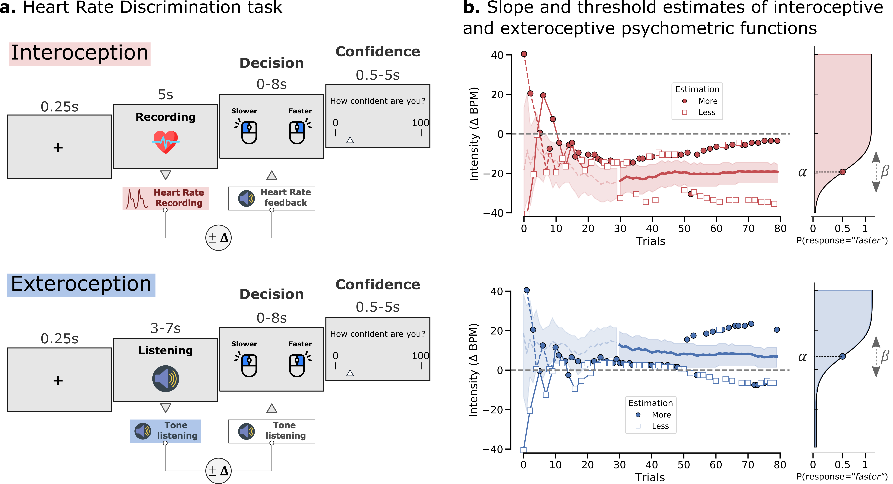
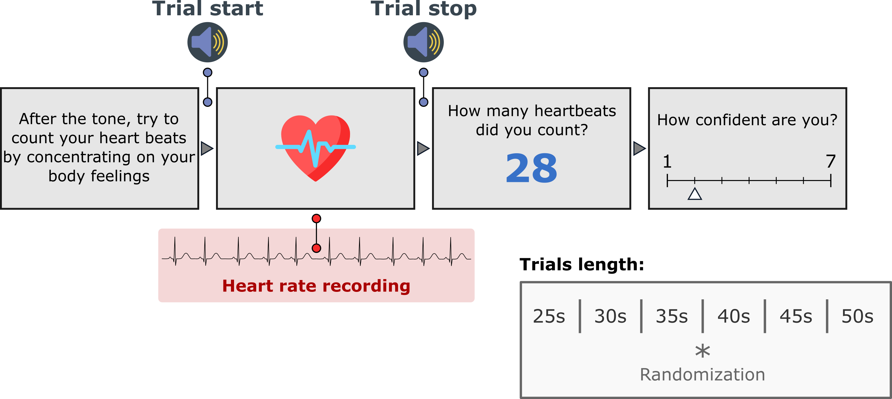
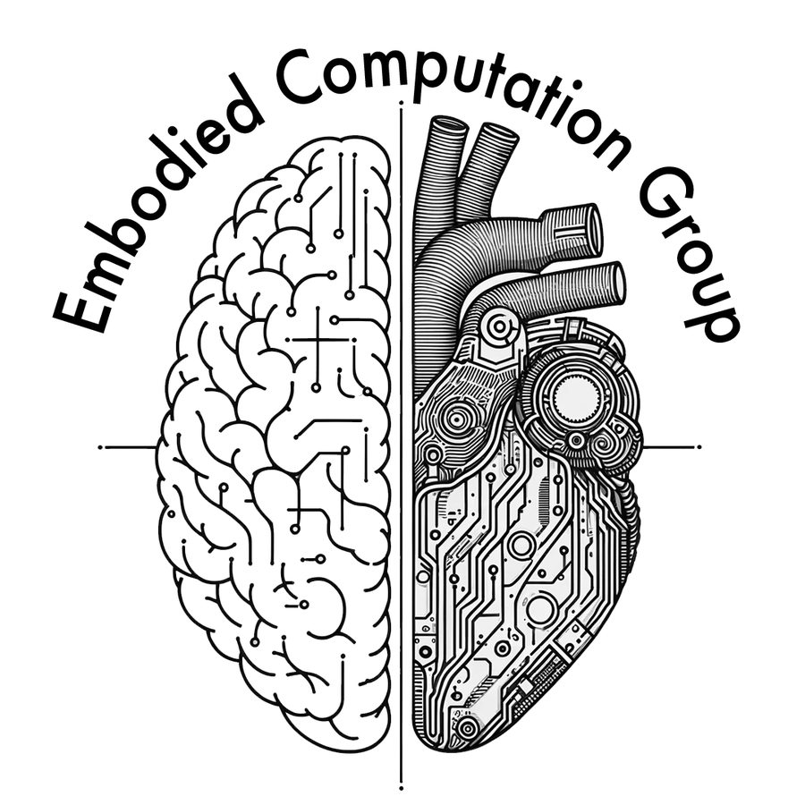

[](https://github.com/embodied-computation-group/Cardioception/blob/master/LICENSE) [](https://GitHub.com/embodied-computation-group/Cardioception/releases/) [](https://github.com/pre-commit/pre-commit) [](https://pypi.org/project/cardioception-toolbox/) [](https://github.com/psf/black) [](http://mypy-lang.org/) [](https://pycqa.github.io/isort/) [](https://doi.org/10.5281/zenodo.22139105)

# Cardioception Toolbox


Cardioception measures cardiac interoception in [PsychoPy](https://www.psychopy.org/). The package is built around the Heart Rate Discrimination task (HRD), a psychophysical method that estimates how accurately and how precisely people judge their own heart rate. It also includes the older Heartbeat Counting task, described [further down](#the-heartbeat-counting-task).

You do not need much equipment. A computer and a device that reads the participant's pulse is enough to run a study, and the tasks slot into richer setups (ECG, M/EEG, fMRI) when you have them.

Documentation lives at <https://www.the-ecg.org/Cardioception/>.

> **Official repository.** This is the original Cardioception, created by Micah Allen and the Embodied Computation Group at Aarhus University between 2019 and 2022, funded by a Lundbeckfonden Fellowship to Micah Allen. It is the version used in the papers listed below. We cannot vouch for unofficial forks, so we recommend working from this repository for research, installation and citation.

## Contents

- [The Heart Rate Discrimination task](#the-heart-rate-discrimination-task)
- [Installation](#installation)
- [Recording devices](#recording-devices)
- [Running a task](#running-a-task)
- [Analysing your data](#analysing-your-data)
- [The Heartbeat Counting task](#the-heartbeat-counting-task)
- [Getting help](#getting-help)
- [How to cite](#how-to-cite)
- [Publications using the HRD](#publications-using-the-hrd)
- [References](#references)
- [Development and credit](#development-and-credit)

## The Heart Rate Discrimination task



On each trial the participant listens to their own body for five seconds and forms an estimate of their heart rate <sup>3</sup>. They then hear five tones played at some frequency, set to their estimated BPM plus or minus an intensity that an adaptive staircase (up/down or psi) keeps adjusting, and they judge whether the tones were faster or slower than their heart.

Because the tone frequency is placed relative to the participant's true heart rate, the procedure separates two things that heartbeat counting confounds: the bias in what people believe their heart rate to be (the threshold of the psychometric function) and how finely they can discriminate it (the slope). You can estimate both online during the task or offline afterwards, along with metacognitive efficiency.

## Installation

> ### Install `cardioception-toolbox`
>
> ```
> pip install cardioception-toolbox
> ```
>
> This is the official package, maintained by the Embodied Computation Group at Aarhus University, and the version described in this repository and used in the papers below. Check that the name you install is exactly `cardioception-toolbox`.

The import name has not changed, so scripts written against earlier versions keep working:

```python
from cardioception.HRD import task
```

To install the development branch instead:

```
pip install git+https://github.com/embodied-computation-group/Cardioception.git
```

### Step by step, from a fresh machine

If you are installing for the first time, or helping someone who is, follow the
**[installation guide](https://www.the-ecg.org/Cardioception/installation.html)**.
It walks through the five steps from installing Python to confirming the pulse
oximeter is producing a real signal, shows the expected output at each step, and
ends with a troubleshooting table covering the errors that actually come up.

The short version, on a machine that already has Python 3.10 or 3.11:

```
python -m venv cardioception-env
cardioception-env\Scripts\activate       # Windows
source cardioception-env/bin/activate    # macOS and Linux
pip install cardioception-toolbox
python -c "from cardioception.HRD import task; print('ok')"
```

### The conda environment file

`environment.yml` is an **alternative** to the three commands above, not an extra step. It is worth using if you already have Anaconda or Miniconda, because it pins the interpreter to 3.10 for you and installs `pywinhook` from conda-forge, which on Windows saves building it from source:

```
conda env create -f environment.yml
conda activate cardioception
```

`environment_linux.yml` is the same with the Linux-specific packages. If you do not already use conda, the `venv` route above works and involves one fewer tool.

If you use the desktop shortcut described below, point it at whichever environment you created rather than at `base`.

### Dependencies

**Python 3.10 or 3.11 is required.** The upper bound comes from `pywinhook`, which publishes wheels only up to 3.11 and otherwise has to be compiled from source on Windows. PsychoPy itself allows 3.12.

Pip installs everything you need. The two that matter are [PsychoPy](https://www.psychopy.org/) for stimulus delivery and [systole](https://github.com/embodied-computation-group/systole) for reading the pulse oximeter, alongside numpy, scipy, pandas and pyserial. [`requirements.txt`](requirements.txt) records the versions we test against.

Analysing the data needs a few extras that are not installed by default: [papermill](https://papermill.readthedocs.io/en/latest/), [matplotlib](https://matplotlib.org/), [seaborn](https://seaborn.pydata.org/), [pingouin](https://pingouin-stats.org/), [metadpy](https://github.com/Embodi3dComputationGroup/metadpy) and [pymc](https://www.pymc.io/welcome.html).

Installing the package also copies about 140 MB of images and sounds that the tasks play, most of it the 370 pre-generated tone files used by the Heart Rate Discrimination task. `pip uninstall cardioception-toolbox` removes them again.

## Recording devices

Both tasks read the participant's cardiac signal while the task runs, either to estimate heart rate or to count beats in a time window. Two setups work out of the box:

* The [Nonin 3012LP Xpod USB pulse oximeter](https://www.nonin.com/products/xpod/) with [Nonin 8000SM soft-clip fingertip sensors](https://www.nonin.com/products/8000s/), which plugs into the stimulus PC over USB and needs no extra code.
* Remote Data Access through BrainVision Recorder with a [Brain Products ExG amplifier](https://www.brainproducts.com/).

Other hardware is straightforward to add. Write a recording class that interfaces with your device and hand it to the task. Anything that gives a reliable estimate of cardiac frequency will do, whether that is ECG, a different pulse oximeter, or something you built yourself.

## Running a task

Each task splits into a `parameters` submodule, which holds the experimental settings, and a `task` submodule, which holds the PsychoPy script. Most of what you will want to change can be passed as an argument to the parameters function; the API documentation covers the full set.

### From a script

```python
from cardioception.HRD.parameters import getParameters
from cardioception.HRD import task

# Set global task parameters
parameters = getParameters(
    participant='Subject_01', session='Test', serialPort=None,
    setup='behavioral', nTrials=10, screenNb=0)

# Run task
task.run(parameters, confidenceRating=True, runTutorial=True)

parameters['win'].close()
```

That runs ten HRD trials with a Psi staircase. The [wrappers](https://github.com/embodied-computation-group/Cardioception/tree/master/wrappers) folder has fuller scripts for both tasks. Copy one into your own task folder, adjust the parameters to suit your design, and run it from a terminal.

### Making a desktop shortcut on Windows

Once your wrapper script is ready, a `.bat` file lets whoever is running the session start the task with a double click, with no terminal involved:

```
call [path to your environment */conda.bat] activate
[path to your local */python.exe] [path to your wrapper */hrd.py]
pause
```

## Analysing your data

### Hierarchical Interoception toolbox

For HRD data we now recommend the [Hierarchical Interoception toolbox](https://github.com/embodied-computation-group/Hierarchical-Interoception), described in [Courtin et al. (2026)](https://doi.org/10.3758/s13428-026-03137-3), which covers the models, the validation work and where the priors come from. It gives you hierarchical psychometric models for HRD and RRST data in Stan and BRMS, tested with parameter recovery; normative priors drawn from large reference datasets that you can drop into your own models; and a power analysis suite as an R Markdown document and a Shiny app for working out how many participants and trials you need.

To get going, clone that repository and run `setup.R`, then open `app & demo/BRMS demo.Rmd` for a worked HRD analysis, or `app & demo/shiny app.R` to plan a study. Please cite Courtin et al. (2026) for the modelling and Cardioception for the data collection.

### R scripts

The R code in `R_analysis/` is kept working for people with existing pipelines. It covers single-subject analysis with reaction times and signal detection measures, group level hierarchical models, Bayesian fits in Stan, and the accompanying plots. The example scripts are a good starting point:

* Single subject: `R_analysis/Example scripts/Example_analysis_simple.Rmd`
* Group level: `R_analysis/Example scripts/Example_analysis_Hierarchical.Rmd`
* Bayesian: `R_analysis/Example scripts/Example_analysis_bayesian.Rmd`

The [R analysis README](R_analysis/README.md) documents them properly.

### Python notebooks

These notebooks are kept for reference and are no longer maintained. For hierarchical modelling, use the toolbox or the R scripts above.

#### Task reports

Results are written to the `'resultPath'` folder you set in the parameters dictionary. For each task there is a notebook that walks through the main results, quality checks and basic preprocessing, and you can generate an HTML report from it:

```python
from cardioception.reports import report

resultPath = "./"  # the folder containing the result files
reportPath = "./"  # the folder where you want to save the HTML report

report(resultPath, reportPath, task='HRD')
```

This writes the HRD report into `reportPath` using the result files in `resultPath`, and needs [papermill](https://papermill.readthedocs.io/en/latest/) installed.

You can also run the notebooks in [Google Colab](https://colab.research.google.com/) and upload your result folder there.

| Notebook | Colab | nbViewer |
| --- | ---| --- |
| Heartbeat Counting task report | [](https://colab.research.google.com/github/embodied-computation-group/Cardioception/blob/master/cardioception/notebooks/HeartBeatCounting.ipynb) | [](https://nbviewer.jupyter.org/github/embodied-computation-group/Cardioception/blob/master/cardioception/notebooks/HeartBeatCounting.ipynb)
| Heart Rate Discrimination task report | [](https://colab.research.google.com/github/embodied-computation-group/Cardioception/blob/master/cardioception/notebooks/HeartRateDiscrimination.ipynb) | [](https://nbviewer.jupyter.org/github/embodied-computation-group/Cardioception/blob/master/cardioception/notebooks/HeartRateDiscrimination.ipynb)

#### Bayesian modelling

These notebooks fit the psychometric function at the subject and group level. They are superseded by the Hierarchical Interoception toolbox, which handles the same problem with better validated models.

| Notebook | Colab | nbViewer |
| --- | ---| --- |
| Fitting the psychometric function (single subject) | [](https://colab.research.google.com/github/embodied-computation-group/Cardioception/blob/master/docs/source/examples/psychophysics/1-psychophysics_subject_level.ipynb) |  [](https://nbviewer.jupyter.org/github/embodied-computation-group/embodied-computation-group/Cardioception/blob/master/docs/source/examples/psychophysics/1-psychophysics_subject_level.ipynb)
| Fitting the psychometric function (group level) | [](https://colab.research.google.com/github/embodied-computation-group/Cardioception/blob/master/docs/source/examples/psychophysics/2-psychophysics_group_level.ipynb) |  [](https://nbviewer.jupyter.org/github/embodied-computation-group/Cardioception/blob/master/docs/source/examples/psychophysics/2-psychophysics_group_level.ipynb)

## The Heartbeat Counting task



Cardioception also implements the heartbeat counting task <sup>1,2</sup>, where participants attend to their heartbeats over intervals of different lengths and report how many they counted. Accuracy comes from comparing that report against the true number of beats. Schandry's original version <sup>1</sup> opened with 60 seconds of rest, then three counting windows (25, 35 and 45 seconds) separated by 30 second rests. Cardioception defaults to the variant used in more recent work <sup>3</sup>: a 20 second training trial, then six counting trials (25, 30, 35, 40, 45 and 50 seconds) in random order. Trial length, condition (`'Rest'`, `'Count'`, `'Training'`) and randomisation are all set in the parameters dictionary.

We keep the task available because a good deal of the literature rests on it and people need to run replications. For new studies, we would point you to the HRD instead. Counting scores are strongly shaped by what participants believe their heart rate to be and by how they interpret the instructions, which makes them hard to read as a measure of interoceptive sensitivity on their own.

## Getting help

For questions about the tasks, contact Micah Allen directly. For bugs, open an issue on the [GitHub page](https://github.com/embodied-computation-group/Cardioception/issues).

## How to cite

If you use Cardioception in a publication, please cite:

>Legrand, N., Nikolova, N., Correa, C., Brændholt, M., Stuckert, A., Kildahl, N., Vejlø, M., Fardo, F., &amp; Allen, M. (2021). The Heart Rate Discrimination Task: A psychophysical method to estimate the accuracy and precision of interoceptive beliefs. Biological Psychology, 108239. <https://doi.org/10.1016/j.biopsycho.2021.108239>

If you use [systole](https://github.com/embodied-computation-group/systole) to talk to your recording device, which is what Cardioception does by default, you may also want to cite:

> Legrand, N. & Allen, M. (2022). Systole: A python package for cardiac signal synchrony and analysis. Journal of Open Source Software, 7(69), 3832, <https://doi.org/10.21105/joss.03832>

## Publications using the HRD

The studies below have used the Heart Rate Discrimination task. If your work is missing, open a pull request or an issue and we will add it.

**2026**

- Banellis, L., Nikolova, N., Ehmsen, J. F., Courtin, A. S., Vejlø, M., Tyrer, A., Böhme, R. A., Bavato, F., Hoogervorst, K., Fardo, F., & Allen, M. G. (2026). Interoceptive performance is unrelated to mental health symptoms in a large multi-domain psychophysical investigation. *Nature Mental Health*, 1–15. <https://doi.org/10.1038/s44220-026-00688-4>
- Courtin, A. S., Ehmsen, J. F., Banellis, L., Fardo, F., & Allen, M. G. (2026). Hierarchical Bayesian modeling of interoceptive psychophysics. *Behavior Research Methods*, 58(9), 260. <https://doi.org/10.3758/s13428-026-03137-3>
- Desdentado, L., Allen, M. G., Schultze, J., Banellis, L., Navarro-Siurana, J., Nikolova, N., Baños, R. M., & Pollatos, O. (2026). Cardiac interoception in action: Modulation after a stress induction with a speech task. *Biological Psychology*, 205, 109228. <https://doi.org/10.1016/j.biopsycho.2026.109228>

**2025**

- Jeganathan, J., Campbell, M. E. J., Legrand, N., Allen, M., & Breakspear, M. (2025). Aberrant cardiac interoception in psychosis. *Schizophrenia Bulletin*, 51(1), 208–216. <https://doi.org/10.1093/schbul/sbae078>
- Tyrer, A., Ehmsen, J. F., Hoogervorst, K., Nikolova, N., Pando-Naude, V., Steenkjær, C. H., Courtin, A. S., Fardo, F., Hauser, T., Bavato, F., & Allen, M. (2025). Peripheral beta-blockade differentially enhances cardiac and respiratory interoception (p. 2025.02.28.640776). *bioRxiv*. <https://doi.org/10.1101/2025.02.28.640776>

**2024**

- Leganes-Fonteneau, M. (2024). Alcohol effects on interoception shape expectancies and subjective effects: A registered report using the heart rate discrimination task. *Alcohol and Alcoholism*, 59(4), agae025. <https://doi.org/10.1093/alcalc/agae025>

## References

1. Dale, A., & Anderson, D. (1978). Information Variables in Voluntary Control and Classical Conditioning of Heart Rate: Field Dependence and Heart-Rate Perception. Perceptual and Motor Skills, 47(1), 79–85. <https://doi.org/10.2466/pms.1978.47.1.79>
2. Schandry, R. (1981). Heart Beat Perception and Emotional Experience. Psychophysiology, 18(4), 483–488. <https://doi.org/10.1111/j.1469-8986.1981.tb02486.x>
3. Legrand, N., Nikolova, N., Correa, C., Brændholt, M., Stuckert, A., Kildahl, N., Vejlø, M., Fardo, F., & Allen, M. (2022). The heart rate discrimination task: A psychophysical method to estimate the accuracy and precision of interoceptive beliefs. In Biological Psychology (Vol. 168, p. 108239). Elsevier BV. <https://doi.org/10.1016/j.biopsycho.2021.108239>
4. Leganes-Fonteneau, M., Cheang, Y., Lam, Y., Garfinkel, S., & Duka, T. (2019). Interoceptive awareness is associated with acute alcohol-induced changes in subjective effects. Pharmacology Biochemistry and Behavior, 181, 69–76. <https://doi.org/10.1016/j.pbb.2019.03.007>
5. Hart, N., McGowan, J., Minati, L., & Critchley, H. D. (2013). Emotional Regulation and Bodily Sensation: Interoceptive Awareness Is Intact in Borderline Personality Disorder. Journal of Personality Disorders, 27(4), 506–518. <https://doi.org/10.1521/pedi_2012_26_049>

## Development and credit

Written by Micah Allen and the Embodied Computation Group, Aarhus University. Contact: micah@cfin.au.dk.

Some of the icons in the figures and in the tasks themselves come from **Flaticon** [www.flaticon.com](www.flaticon.com).


