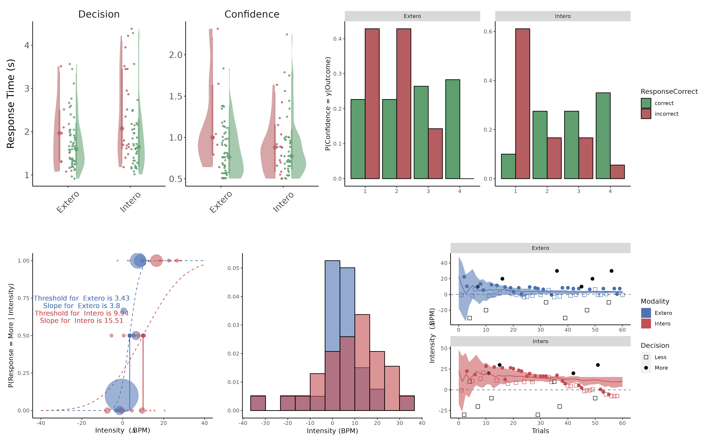
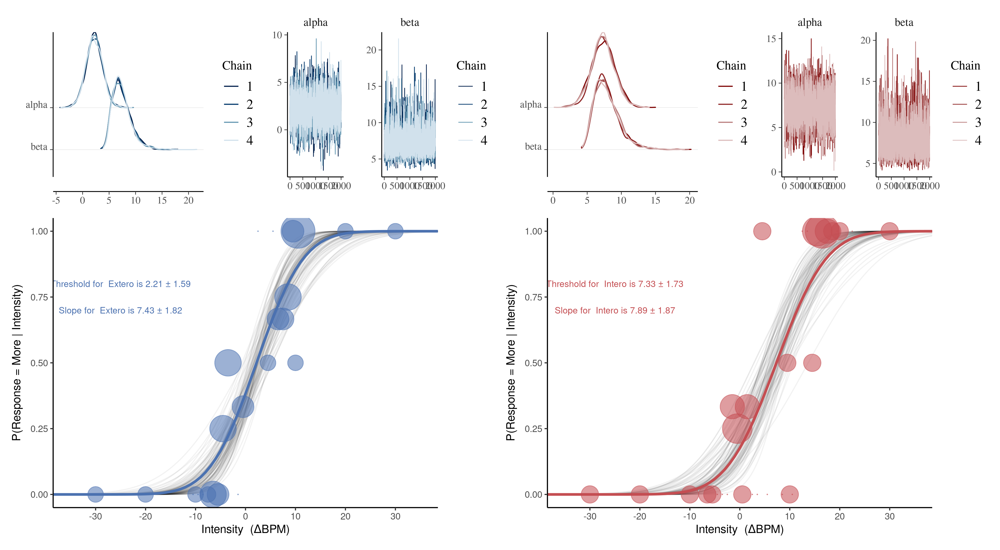

# R Analysis for Cardioception HRD Task

**⚠️ IMPORTANT: This is the RECOMMENDED analysis approach for Cardioception data.**

The Python analysis tutorials are deprecated. Please use these R analysis scripts for all Cardioception data analysis.

## 📊 Analysis Overview

This directory contains the complete R implementation for analyzing Heart Rate Discrimination (HRD) task data from Cardioception. The analysis includes:

- **Individual subject analysis** with reaction time plots and signal detection theory metrics
- **Group-level hierarchical analysis** 
- **Bayesian analysis** using Stan models
- **Comprehensive visualization** of results

## 📁 Directory Structure

```
├── README.md                  <- This file
├── data/                      <- Example data files
├── readme_figures/            <- Example output figures
├── src/                       <- Core analysis functions
│   ├── firstlevelanalysis.R   <- Main analysis function
│   ├── helpers.R              <- Utility functions
│   └── *.stan                 <- Stan models for Bayesian analysis
└── Example scripts/           <- Complete analysis tutorials
    ├── Example_analysis_simple.Rmd      <- Basic analysis
    ├── Example_analysis_Hierarchical.Rmd <- Group analysis
    └── Example_analysis_bayesian.Rmd    <- Bayesian analysis
```

## 🚀 Quick Start

1. **For individual subject analysis**: See `Example scripts/Example_analysis_simple.Rmd`
2. **For group-level analysis**: See `Example scripts/Example_analysis_Hierarchical.Rmd`
3. **For Bayesian analysis**: See `Example scripts/Example_analysis_bayesian.Rmd`

## 📈 Example Output

### Standard Analysis Results


### Bayesian Analysis Results


*Note: The Bayesian analysis example uses different participant data, hence the different threshold and slope values.*

## 🔧 Requirements

- R with tidyverse, ggdist, psycho, caret, patchwork, gt, cowplot, grid, reticulate, here, rmarkdown
- For Bayesian analysis: cmdstan and rstan
- Python numpy (for loading .npy files)

## 📖 Documentation

See the individual R Markdown files in `Example scripts/` for detailed tutorials and workflow examples.
