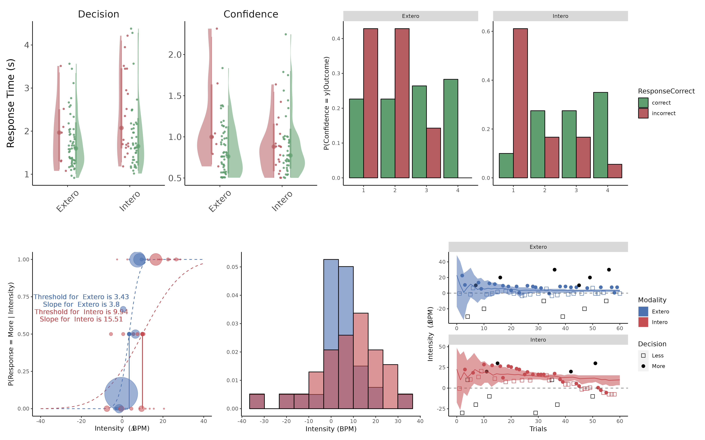
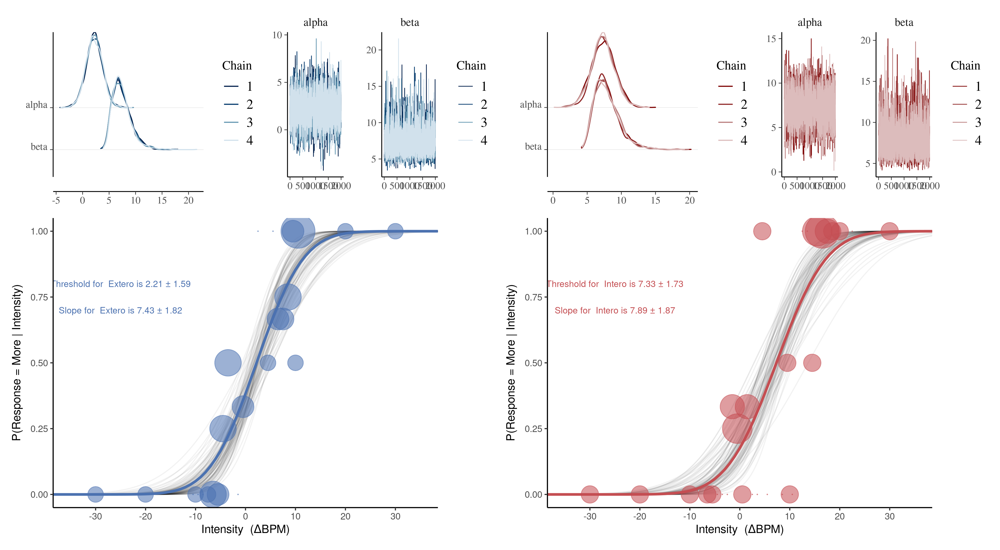

# R analysis for the Cardioception HRD task

Important: this is the recommended analysis approach for Cardioception data. The Python analysis tutorials are deprecated, so use the R scripts here instead.

## Analysis overview

This directory holds the R implementation for analyzing Heart Rate Discrimination (HRD) task data from Cardioception. It covers single-subject analysis, with reaction time plots and signal detection theory metrics, group-level hierarchical analysis, and Bayesian analysis using Stan models. The scripts also produce plots of the results.

## Directory structure

```
├── README.md                  <- This file
├── data/                      <- Example data files
├── readme_figures/            <- Example output figures
├── src/                       <- Core analysis functions
│   ├── firstlevelanalysis.R   <- Main analysis function
│   ├── helpers.R              <- Utility functions
│   └── *.stan                 <- Stan models for Bayesian analysis
└── Example scripts/           <- Complete analysis tutorials
    ├── Example_analysis_simple.Rmd      <- Basic analysis
    ├── Example_analysis_Hierarchical.Rmd <- Group analysis
    └── Example_analysis_bayesian.Rmd    <- Bayesian analysis
```

## Quick start

Single-subject analysis is covered in `Example scripts/Example_analysis_simple.Rmd`, group-level analysis in `Example scripts/Example_analysis_Hierarchical.Rmd`, and the Bayesian version in `Example scripts/Example_analysis_bayesian.Rmd`.

## Example output

### Standard analysis results


### Bayesian analysis results


The Bayesian example uses data from a different participant, which is why the threshold and slope values differ.

## Requirements

- R with tidyverse, ggdist, psycho, caret, patchwork, gt, cowplot, grid, reticulate, here, rmarkdown
- For Bayesian analysis: cmdstan and rstan
- Python numpy (for loading .npy files)

## Documentation

The R Markdown files in `Example scripts/` walk through each analysis step by step.
