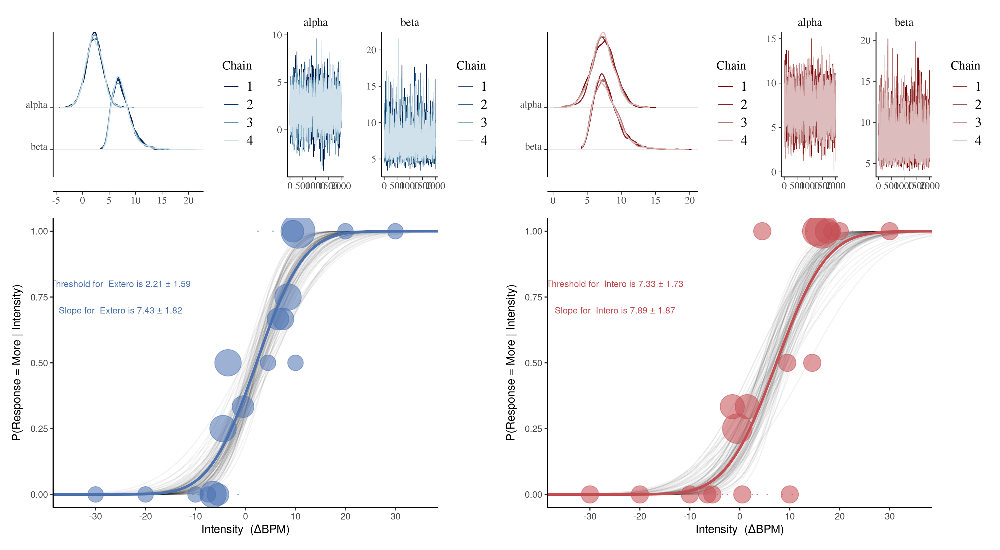

# R Implementation of the HRD-task

Here we represent the analysis of the HRD-task in R, as already implemented in Python.

The organization of the project is as follows:


```
├── README.md                  <- The top-level README for this project.
|
├── data                       <- folder with example data
|
├── ReadMe_figures             <- Folder for the figures used in the ReadMe
|   
├── scr                        <- The main folder for scripts
|
└── Example scripts            <- Folder that contains example analysis markdown scripts and HTML

```

## Readers are encouraged to check out the two markdown for the workflow in the Example scripts folder


## The following plots will be produced when running through the analysis


## If the user wants to run a bayesian analysis on the data this can be done and you'll receive this plot



#### Note that this bayesian analysis is made on a different participant than the composite plot above. Which is why there seems to be widely different values for the threshold and slope, in the two plots.
