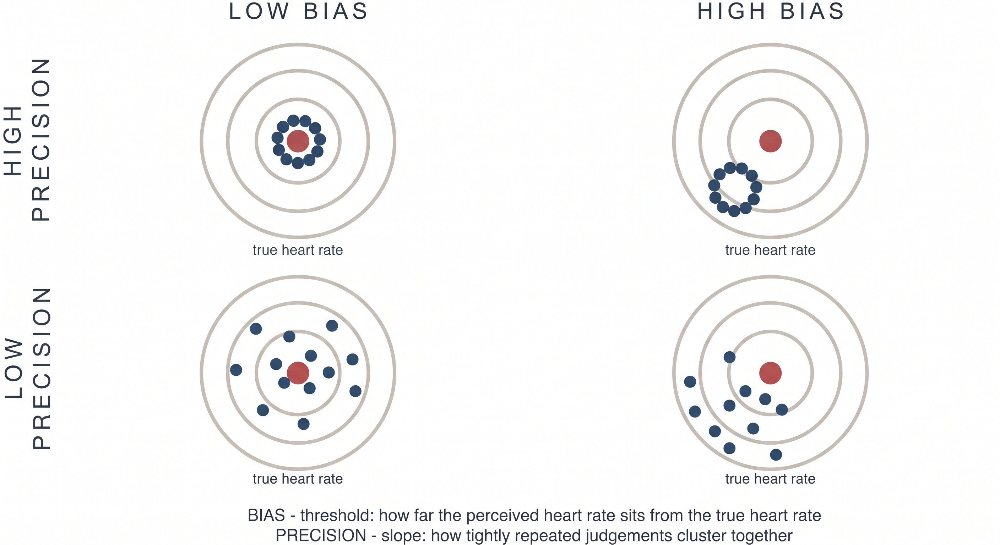

---
myst:
  html_meta:
    description: "What the Heart Rate Discrimination and Heartbeat Counting tasks measure, and why the HRD separates interoceptive bias from interoceptive precision."
    keywords: "cardiac interoception, heart rate discrimination, heartbeat counting, interoceptive accuracy, interoceptive precision, psychophysics"
---

# Theory

Author: Micah G. Allen

Before you analyse an HRD dataset, you need to be clear about what the task can
measure. Cardiac interoception is often described as the ability to perceive
one's heartbeat accurately. That description sounds straightforward until we
ask what an experimental score actually identifies.

We developed the Heart Rate Discrimination task to estimate three distinguishable
features of cardiac judgement: perceptual bias, perceptual precision, and the
relationship between confidence and performance. Together they describe a
person's beliefs about their heart rate under particular task conditions. This
is a narrower claim than measuring a general interoceptive ability.

This page explains that position and the evidence behind it. The practical
tutorials build on these distinctions.

## Cardiac interoception as a measurement problem

Interoception encompasses the processes by which the nervous system senses,
interprets, and regulates the internal state of the body. Cardiac interoception
is one part of that larger system. It has been studied extensively because the
heartbeat is continuous, discrete, and easy to record, and because bodily
signals are thought to contribute to emotion, cognition, and the sense of self
{cite:p}`2022:legrand,2022:garfinkel`.

The experimental difficulty is that a heartbeat is an endogenous stimulus. In
most laboratory studies we can record it, but we cannot set its intensity and
timing as freely as we would set the contrast of a visual stimulus. A participant's
response may therefore reflect several sources of information at once, including
afferent cardiac signals, prior knowledge of heart rate, attention, decision
strategy, and the current physiological context. A task score does not separate
these sources simply because it is compared with an objective recording.

This problem is clearest in the two task families that have dominated the
cardiac interoception literature. Brener and Ring provide a detailed review
{cite:p}`2016:brener`.

### What heartbeat counting can establish

In the heartbeat counting task {cite:p}`1981:schandry,1978:dale`, participants
report how many heartbeats they experienced during a fixed interval. The reported
count is compared with the recorded count to produce an accuracy score. The task
is brief and simple to administer, which helps explain its very large literature.

A plausible estimate of resting heart rate can produce a good counting score
without reliable detection of individual heartbeats. Several results show how
strongly prior knowledge contributes:

- In patients with cardiac pacemakers, actual rates of 61, 76, and 109 BPM
  produced reported rates of 52, 54, and 59 BPM. The reports changed very little
  as the heart rate changed {cite:p}`1999:windmann`.
- Counting scores tend to improve when participants lie down. In one study,
  reported rates were similar when supine and standing, at 50 and 48 BPM, while
  recorded rates differed substantially, at 70 and 86 BPM. The score improved
  because the recorded rate moved closer to the participant's estimate
  {cite:p}`2016:brener`.
- Heart-rate feedback can improve later counting scores even when the feedback
  is unrelated to the participant's own heart. This changes knowledge of heart
  rate without demonstrating increased cardiac sensitivity {cite:p}`2016:brener`.

The scoring rule adds further ambiguity. Systematic undercounting has a large
influence on the score, and sensitivity cannot be separated from response bias
{cite:p}`1996:ring,2018:zamariola,2020:desmedt`. A high counting score is therefore
insufficient evidence that the participant detected their heartbeats. It may
reflect sensation, knowledge, or a favourable combination of the two. The large
literature built with the task remains informative within that constraint
{cite:p}`2022:ferentzi`.

### What fixed-delay synchrony tasks can establish

The other common approach is a two-alternative heartbeat synchrony task
{cite:p}`1977:whitehead`. Tones or flashes are presented at two delays from the
ECG R-wave, and participants judge which sequence is simultaneous with their
heartbeat. Successful performance requires access to cardiac timing, which is a
clear advantage over counting.

The usual implementation assumes that heartbeat sensations occur at similar
latencies across people. Multi-interval studies show substantial individual
variation, with preferred intervals distributed across approximately R+100 to
R+400 ms {cite:p}`2016:brener`. Consider a participant whose heartbeat sensation
occurs at R+256 ms. Tones at R+128 and R+384 ms are equally distant from that
sensation, so the participant may treat both as equally synchronous. Their poor
discrimination would be compatible with a clearly perceived heartbeat at a
latency the task did not sample.

Fixed-delay tasks consequently risk false negatives. Only about one quarter of
participants meet the conventional detector criterion in common versions of the
task, and performance improves when stimulus delays better accommodate individual
cardiac timing {cite:p}`2016:brener`. A failure to discriminate two chosen delays
does not uniquely identify an absence of heartbeat sensation.

### Why the traditional tasks disagree

Heartbeat counting and fixed-delay synchrony tasks are often placed under the
same heading of interoceptive accuracy. If they measured the same ability, their
scores should show a reasonably stable association. In practice, correlations
are generally weak or absent {cite:p}`2016:brener`.

This disagreement is informative. Counting is vulnerable to good performance
based on prior knowledge, while a fixed-delay task can miss participants whose
sensation occurs at an unexpected latency. Combining both under a single label
does not resolve either measurement problem.

## A dimensional framework

Garfinkel and colleagues proposed a useful distinction among three aspects of
interoception {cite:p}`2015:garfinkel`:

| Dimension | Intended construct | Typical assessment |
|---|---|---|
| Interoceptive accuracy | Detection of internal events | Objective task performance |
| Interoceptive sensibility | Attention to and beliefs about internal states | Self-report questionnaires |
| Interoceptive awareness | Insight into one's own task performance | Confidence-based metacognitive measures |

The framework prevents us from treating task performance, questionnaire scores,
and metacognition as versions of the same variable. That was an important advance,
and later work has extended the framework across bodily systems and additional
dimensions {cite:p}`2022:garfinkel`.

The label attached to a task does not establish its construct validity. Calling
heartbeat counting and fixed-delay synchrony measures "interoceptive accuracy"
still leaves their opposite biases and weak correspondence unexplained. Murphy
makes the broader point that progress now depends on better measurement and a
more careful account of individual differences, including state dependence and
the context in which a person uses bodily information {cite:p}`2023:murphy`.

We retain the dimensional view. For the HRD, we define each quantity from the
behaviour that identifies it and avoid treating accuracy as a general-purpose
label.

## A stronger measure of heartbeat timing

The method of constant stimuli offers an instructive comparison. It presents
signals at several delays spanning the cardiac cycle, commonly from R+0 to
R+500 ms, and asks whether each signal was simultaneous with a heartbeat
sensation {cite:p}`1993:brener`.

Sampling several delays allows the participant's data to reveal two quantities.
The preferred delay locates the heartbeat sensation within the cardiac cycle.
The spread of preferred delays measures the temporal precision of detection.
This design addresses the main ambiguity of fixed-delay tasks and shows good
agreement with related multi-interval procedures {cite:p}`2016:brener`.

Its practical demands are substantial. A standard session takes about 35 minutes,
and implementations can take considerably longer once familiarisation is included
{cite:p}`2016:brener,2022:legrand`. The task also requires precise synchronization
of cardiac and external events. Participants must attend to both streams and make
a temporal judgement, which adds demands beyond sensing the heartbeat itself.

For studies concerned specifically with the timing and reliability of afferent
heartbeat sensations, this remains an important design. The HRD addresses a
different question.

## Why the HRD measures cardiac beliefs

The HRD treats a person's estimate of their heart rate as the target of
measurement. This choice is motivated by both the limitations of existing tasks
and a computational account of interoception.

### Interoception involves inference

Predictive processing models describe interoception as inference about bodily
state. The nervous system combines visceral evidence with prior expectations,
with their relative influence depending on estimated precision
{cite:p}`2018:allen_friston,2018:allen_tsakiris,2021:petzschner`. Affect, context,
and anticipated physiological demands can also shape this process. Related work
has developed these ideas as candidate mechanisms for psychiatric and
psychosomatic symptoms {cite:p}`2018:owens`.

On this account, a report about the heart reflects an estimate formed from
several sources of information. Prior beliefs are part of the perceptual process
we want to understand. They cannot be treated only as contamination between an
afferent signal and a verbal response.

The measurement claim is behavioural. The HRD estimates the bias and precision
expressed in repeated perceptual judgements. Identifying a neural prior or
afferent precision requires additional measurements and experimental
manipulations. HRD parameters can be related to physiological, neural, or
clinical variables when the study design supports that inference.

### From repeated judgements to a psychometric function

Experimental work on heart-rate discrimination dates to the 1960s and includes
studies of exercise, training, and heart-rate control
{cite:p}`1960:mandler,1977:whitehead,1981:jones,1982:grigg`. The HRD revisits this
question with an adaptive psychophysical procedure {cite:p}`2022:legrand`.

On a cardiac trial, the participant attends to their heart and then hears a tone
sequence. The tones are faster or slower than the heart rate measured during the
listening interval. The participant chooses "faster" or "slower," and the task
adjusts the difference in BPM across trials. An exteroceptive trial uses the same
judgement between two tone sequences.

The probability of a "faster" response is modelled as a function of the exact
stimulus difference. This separates two properties that an accuracy score mixes
together:

- The threshold is the point of subjective equality. It measures signed bias in
  the participant's estimate of heart rate. A negative threshold indicates that
  the participant judged a tone below the recorded heart rate as equal to it.
- The psychometric slope describes how sharply choices change around the
  threshold. A steeper transition indicates more precise discrimination. Check
  the parameterization when reporting a model because the online Psi value and
  the offline model encode slope in opposite directions.

The dartboard is an analogy for these two properties. The centre of a cluster
represents bias and its spread represents precision. Although the diagram uses
repeated point estimates, the HRD identifies the corresponding centre and spread
from binary choices across stimulus intensities. A participant can show little
bias and poor precision, or substantial bias and high precision. The psychometric
function distinguishes these cases.

The scientific model also includes a lapse rate. Lapses describe responses that
are weakly related to stimulus intensity and prevent an occasional mistake at an
easy intensity from distorting the estimated threshold or slope. Lapse rate is a
feature of the response process, not a measure of interoceptive ability.

### Confidence adds a separate measurement problem

The HRD records confidence after each choice. These ratings support two distinct
questions. Overall confidence describes metacognitive bias. In the ordered beta
model, the difference in confidence between correct and incorrect trials describes
metacognitive calibration.

We use calibration specifically for the `Accuracy` coefficient and its interactions
in this model. We reserve metacognitive sensitivity and efficiency for quantities
derived from an SDT model, such as meta-$d'$ and the M-ratio
{cite:p}`2014:fleming`.

We also no longer recommend the M-ratio for this task. Psi samples stimuli around
each participant's subjective equality point, while accuracy is scored relative
to the recorded heart rate. As bias increases, the type-1 response table needed
for d-prime and meta-d-prime becomes increasingly unbalanced. The resulting
ratio is least stable for participants with the largest cardiac biases. Our
current analysis models the 0 to 100 ratings directly with ordered beta regression,
retaining responses at both bounds {cite:p}`2023:kubinec`. The
[metacognition tutorial](tutorials/metacognition.md) develops this analysis.

### The exteroceptive condition provides a within-person comparison

In the exteroceptive condition, participants compare a tone sequence with a
previously heard tone rather than with their heart. The response mapping,
adaptive procedure, and confidence scale are otherwise closely matched. This
gives us a within-person comparison for general temporal discrimination,
response selection, and confidence use.

Treat this condition as a matched within-person comparator rather than a pure
subtraction. Some nonspecific processes remain, but the comparison tells us
whether a pattern is more pronounced for cardiac judgements than for a similar
auditory judgement. In the original validation study of 223 participants,
cardiac judgements were more negatively biased and less precise. They also had
a lower M-ratio under the metacognitive analysis used in that paper
{cite:p}`2022:legrand`.

## What you may conclude from the HRD

The main quantities answer specific behavioural questions:

| Quantity | Model term | Question answered |
|---|---|---|
| Cardiac bias | Threshold | At which difference in BPM are "faster" and "slower" responses equally likely? |
| Cardiac precision | Slope | How sharply do choices change around that threshold? |
| Stimulus-independent responding | Lapse rate | How often are choices poorly related to stimulus intensity? |
| Confidence bias | Confidence intercept | How high are confidence ratings overall? |
| Metacognitive calibration | Accuracy effect on confidence | How much higher is confidence on correct than incorrect trials? |

These quantities are more informative than a single accuracy score because the
model keeps bias, precision, lapses, and confidence apart. Their interpretation
still depends on the study. Attention, physiology, memory, learning, and context
can all affect an HRD session. A single session should not be assumed to reveal a
stable trait, and an association with a clinical variable does not by itself
identify a neural mechanism.

For group inference, fit the trial-level responses with the hierarchical model
described by Courtin and colleagues {cite:p}`2026:courtin`. The online Psi
estimates are useful for monitoring data collection, but they are not outcome
variables for a group analysis.

## Where to go next

The tutorials follow the analysis from one session to a group model:

- [Inspecting and plotting data](tutorials/inspecting-data.md) explains the trial
  files and the checks we use during data collection.
- [The psychophysical model](tutorials/psychophysics.md) introduces threshold,
  slope, lapse rate, and a single-participant fit.
- [Hierarchical modelling](tutorials/hierarchical.md) estimates participant and
  population effects in one model.
- [Metacognition](tutorials/metacognition.md) models confidence bias and
  metacognitive calibration.

For task administration and staircase settings, see the
[user guide](user_guide.md).
