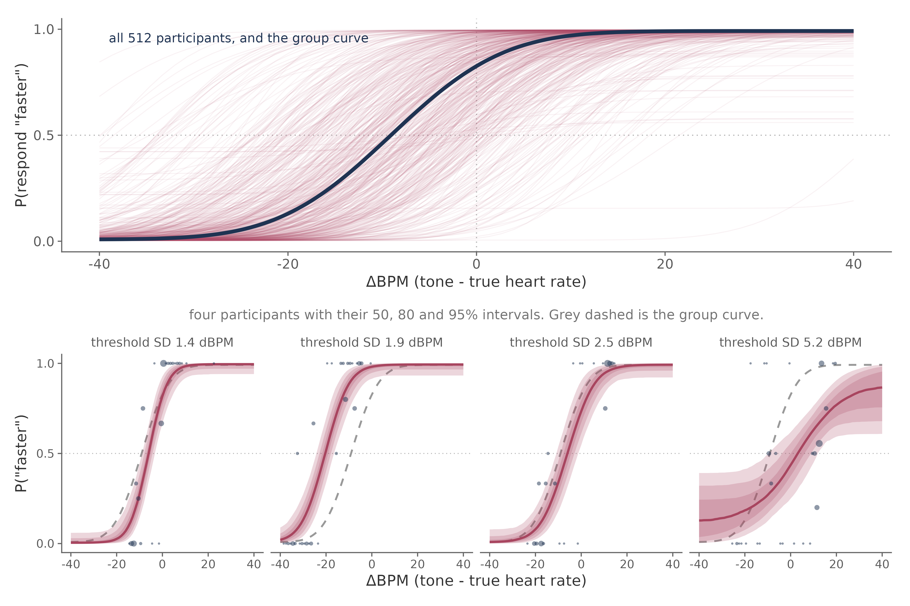
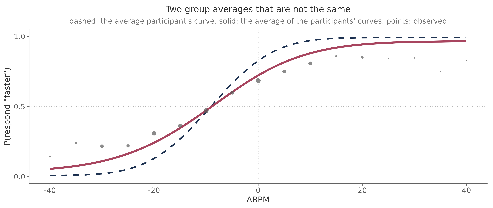

# Hierarchical modelling

Most HRD studies concern a population. You may want to estimate the average
cardiac bias in a sample, compare two groups, or ask whether age is associated
with discrimination precision. These questions are best addressed by fitting
the trial data in one hierarchical model.

The model estimates a psychometric function for each participant while also
estimating the population from which those functions vary. This preserves the
uncertainty in each participant's parameters and allows information to be
shared across the sample.

This tutorial assumes that you have read [the psychophysical
model](psychophysics.md) and prepared the data as described in [inspecting your
results](inspecting-data.md).

```{note}
The HRD measures the bias and precision of judgements about heart rate. Its
parameters should not be interpreted as pure measures of ascending cardiac
afferent sensitivity. Participants may also draw on prior beliefs, somatic
cues, temporal estimation, and memory for the listening interval.
```

## Why use a hierarchical model

The Psi staircase concentrates trials near each participant's point of
subjective equality. This is efficient for estimating the threshold, but it
leaves relatively few observations in the tails of the psychometric function.
Slopes can therefore be weakly constrained at the participant level.

A separate fit for every participant gives no way to carry this variation in
uncertainty into a group analysis. Once the resulting point estimates are put
into a t-test or regression, a threshold known within 1 BPM receives the same
weight as one known within 10 BPM.

The hierarchical model avoids that loss of information. The figure below shows
all 512 participant curves from the worked dataset together with the population
curve. The four lower panels were selected to span the posterior uncertainty in
individual thresholds.



The values above the lower panels are posterior standard deviations of the
threshold. They range from 1.4 ΔBPM for the first participant to 5.2 ΔBPM for
the fourth. Across the full sample they range from approximately 1.1 to 17.2
ΔBPM. These numbers describe how precisely a threshold is known, not where the
threshold lies.

Partial pooling also regularizes poorly constrained individual fits. Each
participant is estimated mainly from their own responses, with increasing
support from the population distribution as their data become less
informative. Participants with clear data remain largely unchanged.

The simplest model has one population distribution and one participant-level
deviation for each psychometric parameter:

```r
bff <- bf(
  y | trials(n) ~ inv_logit(lambda) / 2 +
    (1 - inv_logit(lambda)) *
      (0.5 + 0.5 * erf(exp(beta) * (x - alpha) / sqrt(2))),
  alpha  ~ 1 + (1 | subj),
  beta   ~ 1 + (1 | subj),
  lambda ~ 1 + (1 | subj),
  nl = TRUE,
  family = binomial(link = "identity")
)
```

The distribution of participant posterior means gives a first impression of
the heterogeneity in the sample. It is not a substitute for the posterior of
the population standard deviations, which should be reported from the model
itself.


## Translate the design into a formula

Predictors can affect threshold, slope, or both. For the worked example we put
the same design terms on `alpha` and `beta`. This allows the data to distinguish
a horizontal shift in the curve from a change in its steepness. Holding one
parameter fixed can force an effect into the other.

The random-effects structure follows the experimental design. A term receives
a participant-level slope when it varies within participants. `Modality`, a
pre-post contrast, and a crossover treatment meet this criterion. Gender, age,
BMI, and diagnostic group do not.

| Study design | Formula for `alpha` and `beta` |
|---|---|
| One condition and one group | `~ 1 + (1 \| subj)` |
| Intero and Extero, pre and post, or drug and placebo | `~ condition + (condition \| subj)` |
| Patients and controls, or gender | `~ group + (1 \| subj)` |
| Age, BMI, or a questionnaire score | `~ age_z + (1 \| subj)` |
| Covariates plus a within-participant condition | `~ Modality + gender + age_z + bmi_z + (Modality \| subj)` |
| A group difference specific to interoception | `~ Modality * group + (Modality \| subj)` |

A term such as `(gender | subj)` asks the model to estimate how a participant's
gender changes across trials. There is no such variation. In a complex model,
this error may appear as divergences or a group standard deviation close to
zero rather than as a helpful error message.

Continuous covariates are centered and scaled over participants:

```r
model_df$age_z <- as.numeric(scale(model_df$age))
model_df$bmi_z <- as.numeric(scale(model_df$bmi))
```

Do this using one row per participant. Scaling the trial table gives more
weight to participants with more usable trials. After scaling, the intercept
describes a participant at the sample mean of the covariates, and each
coefficient is expressed per sample standard deviation.

## The worked design

The worked dataset contains 512 participants who completed both HRD conditions.
The model includes gender, age, and BMI. `Modality` varies within participants;
the other predictors vary between participants.

```r
alpha  ~ Modality * (gender + age_z) + bmi_z + (Modality | subj)
beta   ~ Modality * (gender + age_z) + bmi_z + (Modality | subj)
lambda ~ 1 + (1 | subj)
```

The interactions with `Modality` address a specific scientific question. They
ask whether the associations with gender and age differ between judgements of
the heart and judgements of the auditory control stimulus. A model containing
only main effects assumes that these associations are identical in the two
conditions.

That assumption may be reasonable for some studies. It should follow from the
research question rather than from a preference for the shortest formula. In
the worked model, BMI is included as a covariate without a modality interaction.

Treatment coding makes the auditory condition and women the reference levels.
The population intercepts therefore describe an exteroceptive judgement by a
woman at the sample mean of age and BMI. Every coefficient below must be read
relative to that reference cell.

## Choose and check the priors

The intercept and population-scale priors come from the population refit in
[Courtin et al. (2026)](https://doi.org/10.3758/s13428-026-03137-3). They provide
useful information about plausible HRD thresholds, slopes, lapse rates, and
between-participant variation.

Each additional coefficient also needs a prior. The worked analysis centers
these priors on zero and scales them relative to the between-participant
standard deviation of the relevant psychometric parameter:

```r
set_prior("normal(0, 11.23)", class = "b", nlpar = "alpha",
          coef = "genderMale")
set_prior("normal(0, 5.62)", class = "b", nlpar = "alpha",
          coef = "age_z")
set_prior("normal(0, 2.81)", class = "b", nlpar = "alpha",
          coef = "ModalityIntero:genderMale")
```

The first prior allows a binary group contrast to be as large as the population
spread in thresholds. The prior for a one-standard-deviation change in age is
half as wide, and the interaction prior is narrower again. These scales are
choices made for this worked example. They should not be presented as
population estimates from Courtin et al.

Check that the priors correspond to coefficients generated by the formula:

```r
get_prior(bff, model_df)
```

The scripts accompanying this tutorial perform this check before sampling.
This is worth doing explicitly whenever the formula changes.

A prior predictive check examines what the model implies before seeing the
responses:

```r
fit_prior <- brm(
  bff,
  data = model_df,
  prior = priors,
  sample_prior = "only",
  chains = 4,
  cores = 4,
  backend = "cmdstanr"
)
```

Plot the implied psychometric curves and inspect the threshold distribution. A
prior that places most thresholds outside the stimulus range describes effects
that the experiment cannot identify.

## Fit and cache the model

```r
fit <- brm(
  bff,
  data = model_df,
  prior = priors,
  chains = 4,
  cores = 4,
  warmup = 2000,
  iter = 4000,
  control = list(adapt_delta = 0.95, max_treedepth = 12),
  backend = "cmdstanr",
  seed = 12345,
  file = "fit_hrd"
)
```

Always set `file`. A full HRD model can take hours, depending on the number of
participants, the formula, the processor, and the Stan configuration. Caching
prevents an accidental rerun from starting the sampler again.

Develop the pipeline on a small subset with short chains. This checks the data
preparation, formula, priors, and post-processing, but it does not produce
reportable estimates. Run the final model with the full dataset and planned
sampling settings.

On a compute node, within-chain threading can reduce elapsed time:

```r
fit <- brm(
  ...,
  chains = 4,
  cores = 4,
  threads = threading(2),
  backend = "cmdstanr"
)
```

The product of `chains` and `threads` should not exceed the number of physical
cores allocated to the job.

## Check the fit

We recommend checking the fit in the following order:

1. Confirm that there are no divergent transitions after warmup.
2. Check whether any transitions reached the maximum tree depth and inspect
   E-BFMI for each chain.
3. Confirm that all relevant `rhat` values are below 1.01 and that bulk and tail
   effective sample sizes are adequate.
4. Examine posterior predictive checks at both the participant and population
   levels.
5. Interpret the coefficients only after these checks are satisfactory.

Increasing `adapt_delta` to 0.99 can help with occasional divergences. Persistent
divergences usually call for another look at the model structure and data. A
random slope on a between-participant factor is one common cause.

### Participant-level checks

Plot fitted curves against the observations for a range of participants. The
panels below span the fitted threshold distribution rather than showing only
the cleanest examples.


Look for systematic departures between the curve and the responses. Some
participants will have wide posterior uncertainty because the staircase did
not obtain enough informative trials. That is expected and should be visible.

### Population-level checks

The pooled check bins the observed responses and compares them with predictions
for the same participants and trials.


The points are observed response proportions. The line and intervals are model
predictions. This is a graphical check of where the model reproduces the data;
the number of bins covered by a 95% interval is not a test of model validity.

Use `posterior_predict()` for predictive intervals. `posterior_epred()` describes
uncertainty in the expected response and omits binomial sampling variation. Its
intervals are therefore too narrow for this particular comparison. Predictions
should also retain participant effects because the adaptive staircase sends
different participants to different parts of the intensity range.

## Interpret the worked model

The fitted curves below show population-level predictions at the sample mean of
age and BMI, separately for gender and modality.


Selected coefficients from the worked model are shown below. The auditory
condition and women are the reference levels.

| Term | Posterior mean | 95% credible interval |
|---|---:|---:|
| `alpha_Intercept` | +0.60 ΔBPM | [0.24, 0.97] |
| `alpha_ModalityIntero` | -9.60 ΔBPM | [-10.77, -8.37] |
| `alpha_genderMale` | -0.09 ΔBPM | [-0.69, 0.49] |
| `alpha_age_z` | -0.62 ΔBPM per SD | [-0.94, -0.32] |
| `alpha_bmi_z` | -0.03 ΔBPM per SD | [-0.33, 0.26] |
| `beta_ModalityIntero` | -0.42 | [-0.48, -0.36] |
| `beta_ModalityIntero:genderMale` | -0.10 | [-0.196, -0.014] |
| `beta_ModalityIntero:age_z` | +0.07 | [0.020, 0.124] |

For the reference participant, the estimated auditory threshold is close to
zero. Adding the modality coefficient gives a cardiac threshold of about -9.0
ΔBPM. This corresponds to judging tones approximately 9 BPM below the true
heart rate as equally likely to be faster or slower.

The negative modality coefficient on `beta` indicates a shallower cardiac
psychometric function. On the more interpretable sigma scale, the fitted values
are approximately 6.3 BPM for the auditory condition and 9.6 BPM for the
cardiac condition. A larger sigma means poorer discrimination.

These are reference-cell estimates. Population-average statements should come
from marginal predictions or contrasts averaged over the sample distribution
of the covariates.

The next figure standardizes each coefficient by the corresponding
between-participant standard deviation. The native-scale estimates remain
printed beside the intervals.


## Read interactions through simple effects

Once an interaction is present, a main-effect coefficient describes the
reference condition. For example, `beta_genderMale` is the gender contrast in
the auditory condition. The corresponding cardiac contrast is the sum of
`beta_genderMale` and `beta_ModalityIntero:genderMale`.

The same rule applies to continuous covariates. `alpha_age_z` is the age slope
in the auditory condition. The cardiac age slope is:

```r
draws <- posterior::as_draws_df(fit)

age_effects <- draws |>
  dplyr::transmute(
    alpha_age_extero = b_alpha_age_z,
    alpha_age_intero = b_alpha_age_z +
      `b_alpha_ModalityIntero:age_z`,
    beta_age_extero = b_beta_age_z,
    beta_age_intero = b_beta_age_z +
      `b_beta_ModalityIntero:age_z`
  )
```

Summarize these derived posterior distributions directly. The interaction tells
you how much the two condition-specific effects differ. It does not, on its
own, establish that either simple effect differs from zero.

The age figure shows the same calculation on the parameter scales, averaged
over the observed gender composition of the sample.


The auditory threshold decreases with age in this dataset. The cardiac trend is
flatter because the modality interaction offsets much of that association. On
the sigma scale, auditory discrimination changes little across age, while the
cardiac curve becomes steeper. Formal claims should be based on the posterior
intervals and probabilities of the simple effects calculated above.

## Report the model

A report should include:

- the psychometric function and response coding;
- the formulas for `alpha`, `beta`, and `lambda`;
- the prior distributions and their justification;
- the number of participants, trials, and aggregated cells;
- sampler settings and diagnostics;
- posterior estimates with credible intervals;
- condition-specific contrasts when interactions are present; and
- participant-level and population-level predictive checks.

Report threshold and slope together. They describe different properties of the
psychometric function, and evidence about one does not imply evidence about the
other.

For a directional claim, report the posterior probability in addition to the
interval:

```r
hypothesis(fit, "alpha_genderMale > 0")
mean(posterior::as_draws_df(fit)$b_alpha_genderMale > 0)
```

Whenever possible, accompany latent-scale coefficients with marginal
predictions or contrasts in ΔBPM and sigma. These are easier to relate to the
task and less dependent on the chosen reference levels.

(two-averages)=
## Population curves and pooled observations

This distinction is useful when a population curve appears not to pass through
pooled observations.

The population-level coefficients describe the psychometric function of a
participant whose random effects are zero. In brms, this is obtained with
`re_formula = NA`. Pooled observations describe a different quantity: the
average response across participants, each with their own threshold, slope, and
lapse rate.

These quantities differ because the psychometric function is nonlinear.
Averaging curves with different thresholds produces a shallower function than
evaluating one curve at the average parameters.



The difference is small in the auditory condition and larger in the cardiac
condition, where participants vary more in threshold:

| Condition | Between-participant threshold SD | Largest difference between curves |
|---|---:|---:|
| Auditory | 2.44 ΔBPM | 0.026 |
| Cardiac | 10.97 ΔBPM | 0.099 |

For model checking, compare each participant with their own fitted curve, or
compare pooled bins with predictions made over the participants and trials that
produced those bins. Avoid comparing pooled observations with the curve of a
zero-random-effect participant.

The adaptive staircase adds a second reason for care. Trials at an extreme
ΔBPM tend to come from participants whose thresholds lie near that value. Those
trials are not a representative sample of the population, and a prediction
over the observed trial structure should preserve that selection.
