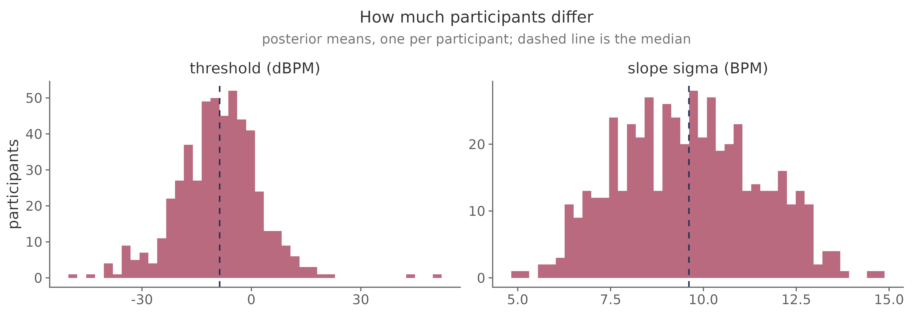
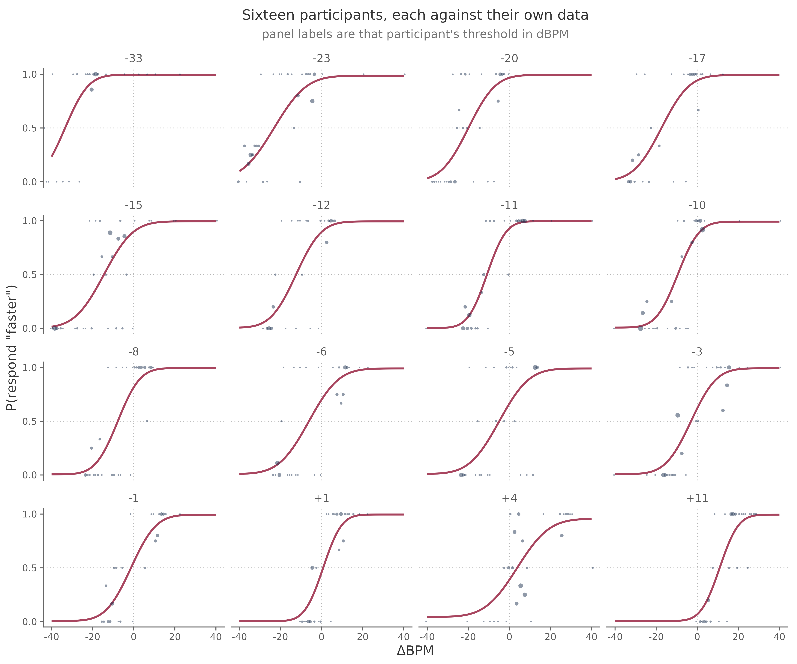
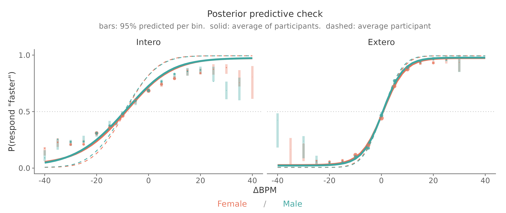
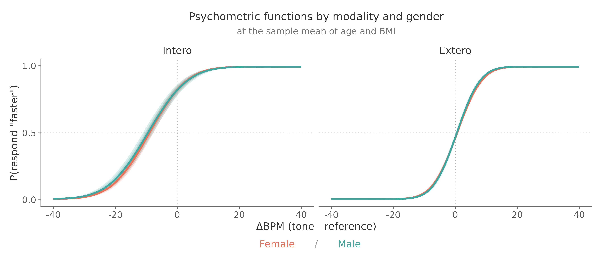
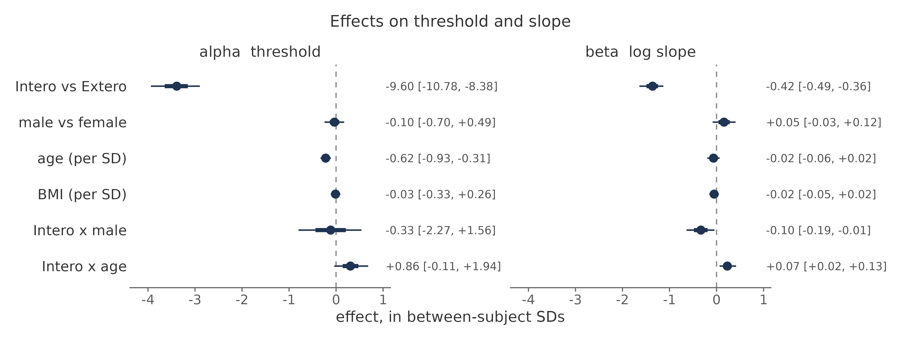
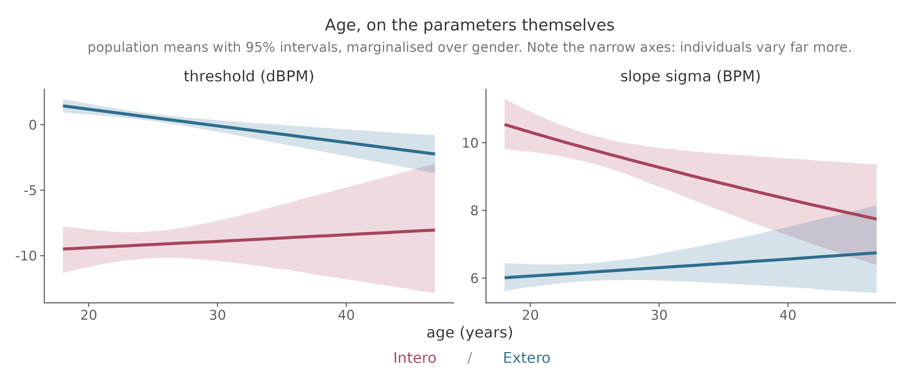

# Hierarchical modelling

Fitting every participant in one model, and testing whether a covariate or a group
membership moves interoceptive bias or precision.

This is the tutorial most studies need. It assumes the
[psychophysical model](psychophysics.md) and the data preparation from
[inspecting and plotting data](inspecting-data.md).

## Why one model rather than many

The staircase gives each participant few trials far from their threshold, so
individual slopes are poorly constrained. Fitting separately and then testing the
point estimates treats a barely identified slope as if it were known exactly.

A hierarchical model draws each participant's parameters from a group
distribution. Participants with sparse data are pulled toward the group, those
with plenty are left alone, and the uncertainty travels through to the group-level
effects instead of being discarded halfway.

It also gives you the spread itself as a parameter rather than as a nuisance, and
in this task that spread is the headline finding as much as any group mean:
participants differ from one another far more than the conditions differ from
each other.



That width is worth holding onto, because it is the yardstick every group effect
below is measured against.

```r
bff <- bf(
  y | trials(n) ~ inv_logit(lambda) / 2 +
    (1 - inv_logit(lambda)) * (0.5 + 0.5 * erf(exp(beta) * (x - alpha) / sqrt(2))),
  alpha  ~ 1 + (1 | subj),
  beta   ~ 1 + (1 | subj),
  lambda ~ 1 + (1 | subj),
  nl = TRUE,
  family = binomial(link = "identity")
)
```

## Adding your design

Predictors go on `alpha` and on `beta`, separately. Put them on both even when your
hypothesis concerns only one: an effect that looks like a threshold shift in a
threshold-only model can turn out to be a slope effect once both are free to move.

The rule that governs the random effects: **a term gets a random slope only if it
varies within a participant.**

| What you are testing | Formula for `alpha` and `beta` |
|---|---|
| Nothing, just the population | `~ 1 + (1 \| subj)` |
| Intero vs Extero, pre vs post, drug vs placebo | `~ condition + (condition \| subj)` |
| Patients vs controls, or gender | `~ group + (1 \| subj)` |
| Age, BMI, a questionnaire score | `~ age_z + (1 \| subj)` |
| A covariate and a group and a within-subject condition | `~ Modality + gender + age_z + bmi_z + (Modality \| subj)` |
| Whether an effect is specific to interoception | `~ Modality * gender + (Modality \| subj)` |

`(gender | subj)` is a specification error. A participant has one gender, so there
is no within-subject variance for the model to find. It does not raise an error: it
produces divergent transitions and group SDs pinned near zero, which is a much
worse way to discover the problem.

Centre continuous covariates, or the intercept becomes the threshold of a
participant aged zero:

```r
model_df$age_z <- as.numeric(scale(model_df$age))
model_df$bmi_z <- as.numeric(scale(model_df$bmi))
```

Scale them over participants, not over trials, or people with more trials pull the
mean.

## The worked model

The example study has both conditions, gender as a between-subject factor, and age
and BMI as subject-level covariates. All of it goes in one model, because covariates
only control for each other when they are fitted together:

```r
alpha ~ Modality * (gender + age_z) + bmi_z + (Modality | subj)
beta  ~ Modality * (gender + age_z) + bmi_z + (Modality | subj)
lambda ~ 1 + (1 | subj)
```

Reading that formula: `Modality` is within-subject and gets a random slope. `gender`
is between-subject and does not. `age_z` and `bmi_z` are subject-level covariates.
The `Modality` interactions ask the question that matters for an interoception
claim: does the effect appear specifically when judging one's own heart, or does it
show up in the auditory control condition too? An effect present in both is telling
you something about the task, not about interoception.

BMI enters as a main effect only. It is there as a control, not as a hypothesis.

## Priors

Every predictor needs its own prior. A prior naming a coefficient brms does not
generate is **silently ignored**, and that coefficient then samples under a flat
default. Check what you actually specified:

```r
get_prior(bff, model_df)
```

The intercept priors come from the population refit in
[Courtin et al. (2026)](https://doi.org/10.3758/s13428-026-03137-3). Effect priors
are centred on zero and scaled to the between-subject SD of the parameter, with
narrower scales where a wide one would be implausible:

```r
set_prior("normal(0, 11.23)", class = "b", nlpar = "alpha", coef = "genderMale")
set_prior("normal(0, 5.62)",  class = "b", nlpar = "alpha", coef = "age_z")
set_prior("normal(0, 2.81)",  class = "b", nlpar = "alpha", coef = "ModalityIntero:genderMale")
```

The logic: a difference between two groups could plausibly be about as large as the
spread between individuals, so a binary contrast gets the full SD. A *per standard
deviation of age* effect that large would not be plausible, so it gets half. An
interaction is a difference of differences, so it gets less again.

Check the choice rather than trusting it. Sampling with the likelihood switched off
shows what the priors alone imply:

```r
fit_prior <- brm(bff, data = model_df, prior = priors, sample_prior = "only", ...)
```

If most of the prior mass puts thresholds outside the range of intensities the task
can present, the prior is asserting something the experiment could never show.

## Fitting

```r
fit <- brm(
  bff, data = model_df, prior = priors,
  chains = 4, cores = 4,
  warmup = 2000, iter = 4000,
  control = list(adapt_delta = 0.95, max_treedepth = 12),
  backend = "cmdstanr",
  file = "fit_hrd"
)
```

Set `file`. It caches the fit, so an accidental rerun does not resample for hours.

**Expect hours on a laptop.** A few dozen participants is tens of minutes; several
hundred with covariates is an overnight job. Develop the pipeline on a handful of
participants with short chains first, confirm it runs end to end, and only then
start the real fit.

The fits behind this page took 4 to 31 minutes each, but that was 8 chains across
128 cores on a compute node, with within-chain threading. The useful lever there is
`threads = threading(n)`, which splits the likelihood within each chain rather than
adding more chains: the likelihood runs over tens of thousands of aggregated cells,
so it parallelises well, while chains past about 8 mostly buy redundant samples.

```r
fit <- brm(..., chains = 4, cores = 4, threads = threading(2), backend = "cmdstanr")
```

Count your real cores before setting this. `chains * threads` above the core count
oversubscribes and runs slower than leaving it alone.

## Checking, in this order

1. **Divergent transitions.** Any at all means the sampler is not exploring the
   posterior properly. Raise `adapt_delta` to 0.99. If they persist, look at the
   formula before the sampler, and check for a random slope on a between-subject
   term.
2. **`rhat < 1.01`**, with bulk and tail ESS in the hundreds at least.
3. **Posterior predictive checks**, and predicted curves against observed
   proportions for a few individual participants.
4. Only then read the coefficients.

The third deserves care, because the obvious version of it is misleading.

**Check participants one at a time first.** Plot each participant's fitted curve
against that participant's own trials. Nothing is pooled, so a departure is
misfit and not an artefact of mixing people together. This is the check the
[Hierarchical Interoception toolbox](https://github.com/embodied-computation-group/Hierarchical-Interoception)
recommends, and it should be your primary one.



```r
# each participant's own parameters, from coef()
cf <- coef(fit)$subj[, "Estimate", ]
```

**Then the pooled check, with its caveat.** Pooling observed proportions across
participants and drawing them against the fitted curve is tempting, and the points
will miss. Usually that is not misfit. Pooled data estimate the *average of the
participants' curves*, while the population curve is the curve *of the average
participant*, and with a threshold SD near 11 ΔBPM those are visibly different
lines. See [two averages that are not the same](psychophysics.md#two-averages).



The points track the solid line, not the dashed one. What actually decides the
question is the bars: the model's predictive interval for each bin, computed over
the real trials. On the worked model 60 of 61 bins fall inside their 95% interval,
and the one that does not misses by 0.003. The model fits.

Use `posterior_predict()` for those bars, not `posterior_epred()`. The expectation
carries uncertainty in the mean but no binomial sampling noise, so as a predictive
interval it is far too narrow in thinly sampled bins and will report misfit that is
nothing but noise.

A third effect shows up at the extremes of this task specifically. The staircase
concentrates trials near each participant's own threshold, so a bin at −40 ΔBPM
is made up of whoever happened to have a threshold out there rather than a fair
sample of the group. The bars respect that, because they are computed over the
trials each participant actually received. A smooth curve cannot.

## What the worked model found

Fitted to 512 participants in both conditions. The auditory condition is the
reference level, so `alpha_Intercept` is the exteroceptive threshold and
`alpha_ModalityIntero` is the shift when judging one's own heart.



| Term | Estimate | 95% CI |
|---|---|---|
| `alpha_Intercept` (Extero) | +0.60 ΔBPM | [0.24, 0.97] |
| `alpha_ModalityIntero` | **−9.60 ΔBPM** | [−10.77, −8.37] |
| `alpha_genderMale` | −0.09 | [−0.69, 0.49] |
| `alpha_age_z` | **−0.62** per SD | [−0.94, −0.32] |
| `alpha_bmi_z` | −0.03 | [−0.33, 0.26] |
| `beta_ModalityIntero` | **−0.42** | [−0.48, −0.36] |
| `beta_ModalityIntero:genderMale` | **−0.10** | [−0.196, −0.014] |
| `beta_ModalityIntero:age_z` | **+0.07** | [0.020, 0.124] |

Two things to read off it. Judgements about tones are close to accurate, while
judgements about one's own heart sit about 9.6 BPM below the truth. And
interoception is the less precise of the two: σ is roughly 6.3 BPM for tones
against 9.6 BPM for the heart.



### Why the interaction earns its place

Fitting the same predictors without their `Modality` interactions gives a tidy and
completely misleading answer about gender:

| Effect on slope | Main effects only | With the interaction |
|---|---|---|
| `beta_genderMale` | **−0.0007** [−0.060, 0.060] | +0.05 [−0.025, 0.125] |
| `beta_ModalityIntero:genderMale` | not estimated | **−0.10** [−0.196, −0.014] |

In the main-effects model the gender term is almost exactly zero. Not "small":
zero to four decimal places, with an interval tight around it. It is tempting to
report that as a clean null.

It is zero because two opposing effects are being averaged. Men are slightly more
precise than women in the auditory condition and less precise in the cardiac one,
and a model with one gender term per parameter has nowhere to put that except in
the average, where it cancels. Age does the same thing on the slope.

This is why the table in [Adding your design](#adding-your-design) suggests
interacting your grouping variable with `Modality` whenever you have both
conditions. The auditory condition is not a formality: an effect that appears in
both is telling you something about the task rather than about interoception.

### A continuous covariate

Age is the one covariate here with an effect on threshold, and it is easier to read
on the parameters themselves than from a stack of overlapping sigmoids.



Read this one carefully, because the main effect on its own would mislead you.
`alpha_age_z` is −0.62 per SD [−0.94, −0.32], and that is the effect **in the
auditory condition**, which is the reference level. The auditory line falls with
age. The cardiac line does not: the interaction (+0.86 [−0.11, +1.94]) roughly
cancels the main effect, leaving it flat or slightly rising.

So "thresholds decrease with age" would be a true statement about the reference
level presented as a statement about interoception. That interaction interval
does span zero, so treat the divergence as suggestive rather than established —
but not as absent, which is what quoting the main effect alone would imply.

The slope panel is the cleaner case, and there the interaction is established
(+0.07 [0.020, 0.124]): cardiac precision improves with age while auditory
precision does not move.

Note the axes. Both panels span a few ΔBPM, while individual participants range
across tens. These are population means, and a real effect on a group mean can be
small next to the spread it sits inside.

A flat line is a result, not a missing finding. BMI produces one, and it is worth
showing: it is a control, and the model says it controls for very little.

## Reporting

Give posterior means with credible intervals. For a directional claim, the
posterior probability is more informative than whether an interval excludes zero:

```r
hypothesis(fit, "alpha_genderMale > 0")
mean(as_draws_df(fit)$b_alpha_genderMale > 0)
```

Report threshold and slope together, and say which condition an effect appeared in.
"Gender affected interoceptive bias" means something quite different depending on
whether the same difference showed up in the auditory control.
