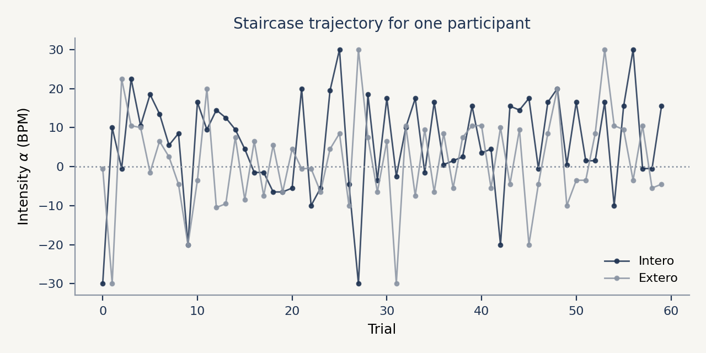
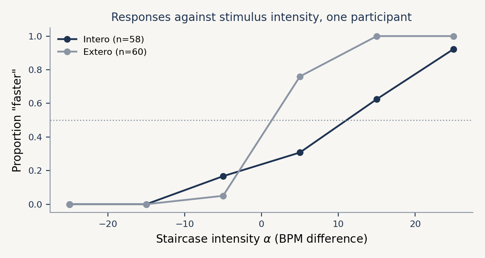
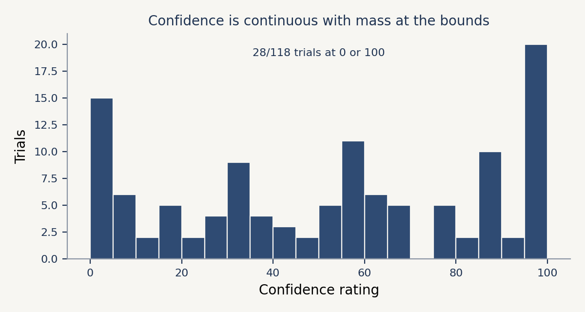
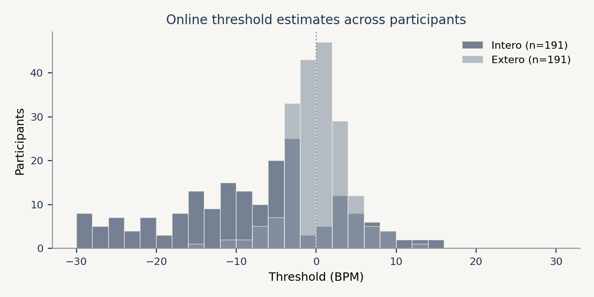

# Inspecting your results

Do this before you fit anything. Most problems with an HRD dataset are visible in five minutes of looking: a participant who never engaged with the task, a pulse trace that dropped out, a timing setting that was too tight for half the trials. None of that is easier to spot after a model has averaged over it.

This page shows the same handful of checks in Python and in R, so you can use whichever you already have open. The figures come from the dataset behind the Cardioception paper: 22,920 trials from 191 participants.

Model fitting itself is done in R with the [Hierarchical Interoception toolbox](https://github.com/embodied-computation-group/Hierarchical-Interoception); see the [modelling tutorials](index.md).

## What the task writes

Each participant gets a folder holding a `final.txt`, with one row per trial, plus the raw PPG signal if you recorded it. The columns used on this page are:

| Column | Meaning |
|---|---|
| `Modality` | `Intero` when judging their own heart, `Extero` when judging tones against tones |
| `Alpha` | The intensity offered on that trial, as a BPM difference from the estimated heart rate |
| `Decision` | `More` or `Less`, the participant's judgement |
| `ResponseCorrect` | 1 or 0 |
| `Confidence` | Rating on a 0 to 100 slider |
| `EstimatedThreshold` | The task's own running estimate, updated by the Psi algorithm |

## Loading

Load one session, then pool the study and keep track of who is who.

```python
from pathlib import Path
import pandas as pd

frames = []
for f in sorted(Path("data").glob("*/*_final.txt")):
    df = pd.read_csv(f)
    df["Subject"] = f.parent.name
    frames.append(df)

data = pd.concat(frames, ignore_index=True)
data.head()
```

```r
library(tidyverse)

data <- list.files("data", pattern = "_final.txt$",
                   recursive = TRUE, full.names = TRUE) |>
  set_names(~ basename(dirname(.x))) |>
  map_dfr(read_csv, .id = "Subject")

head(data)
```

## Checking what is missing

Trials where the participant ran out of time have no decision. Count them before anything else, and drop them from what you model.

```python
print(f"{data.Decision.isna().sum()} trials without a decision")
print(f"{(~data.RatingProvided.astype(bool)).sum()} trials without a rating")

clean = data[data.Decision.isin(["More", "Less"])].copy()
clean["resp"] = (clean.Decision == "More").astype(int)
```

```r
cat(sum(is.na(data$Decision)), "trials without a decision\n")
cat(sum(!data$RatingProvided), "trials without a rating\n")

clean <- data |>
  filter(Decision %in% c("More", "Less")) |>
  mutate(resp = as.integer(Decision == "More"))
```

A handful of missed trials is normal. A participant missing a quarter of them was not doing the task as intended, and you should decide what to do about that now rather than later.

## The staircase

This is the single most useful plot. It shows the intensity offered on each trial, and it should start wide and settle towards the participant's threshold.



```python
import matplotlib.pyplot as plt

sub = clean[clean.Subject == "sub-01"]

fig, ax = plt.subplots(figsize=(7, 3.5))
for modality in ["Intero", "Extero"]:
    m = sub[sub.Modality == modality].reset_index(drop=True)
    ax.plot(m.index, m.Alpha, "-o", markersize=3, linewidth=1, label=modality)

ax.axhline(0, linestyle=":", color="grey")
ax.set(xlabel="Trial", ylabel="Intensity (BPM)")
ax.legend(frameon=False)
```

```r
clean |>
  filter(Subject == "sub-01") |>
  group_by(Modality) |>
  mutate(Trial = row_number()) |>
  ggplot(aes(Trial, Alpha, colour = Modality)) +
  geom_line() + geom_point(size = 1) +
  geom_hline(yintercept = 0, linetype = "dotted") +
  labs(y = "Intensity (BPM)") +
  theme_classic()
```

Two failure modes are obvious here. A trace that wanders without settling means the responses carried little information. A trace that runs to the edge of the range and stays pinned there means the participant was at ceiling or floor, and the threshold for that session is not identified.

## Responses against intensity

This is the shape the model will fit. Bin the intensities first, because a staircase visits most values only once or twice.



```python
import numpy as np

s = sub[sub.Modality == "Intero"]
bins = np.linspace(s.Alpha.min(), s.Alpha.max(), 8)
centres = (bins[:-1] + bins[1:]) / 2
idx = np.digitize(s.Alpha, bins[1:-1])
proportion = [s.resp[idx == i].mean() for i in range(len(centres))]

fig, ax = plt.subplots(figsize=(7, 3.5))
ax.plot(centres, proportion, "o-")
ax.axhline(0.5, linestyle=":", color="grey")
ax.set(xlabel="Intensity (BPM)", ylabel='Proportion "faster"')
```

```r
clean |>
  filter(Subject == "sub-01", Modality == "Intero") |>
  mutate(bin = cut_number(Alpha, 7)) |>
  group_by(bin) |>
  summarise(centre = mean(Alpha), proportion = mean(resp)) |>
  ggplot(aes(centre, proportion)) +
  geom_line() + geom_point() +
  geom_hline(yintercept = 0.5, linetype = "dotted") +
  labs(x = "Intensity (BPM)", y = "Proportion \"faster\"") +
  theme_classic()
```

The curve should rise from left to right and cross 0.5 somewhere near the participant's bias. Note how few trials sit far from that crossing point. That thinness in the tails is why the slope is estimated across participants rather than one at a time.

## Confidence

The rating is a slider bounded at 0 and 100, and people genuinely use both ends.



```python
fig, ax = plt.subplots(figsize=(7, 3.5))
ax.hist(clean.Confidence.dropna(), bins=np.arange(0, 105, 5))
ax.set(xlabel="Confidence rating", ylabel="Trials")

print(f"{clean.Confidence.isin([0, 100]).mean():.1%} of ratings sit on a bound")
```

```r
ggplot(clean, aes(Confidence)) +
  geom_histogram(binwidth = 5) +
  labs(y = "Trials") +
  theme_classic()

mean(clean$Confidence %in% c(0, 100))
```

Worth checking two things: whether the ratings span the scale at all, and how much mass sits exactly on the bounds. A participant who left the slider at one value all session has given you no metacognitive information. The pile-up at the ends is normal, and is why confidence is modelled with ordered beta regression rather than anything Gaussian.

## A first look at the group

`EstimatedThreshold` holds the task's own running estimate. It is not a replacement for fitting the model, but it is a fast sanity check across a sample.



```python
last = (data.dropna(subset=["EstimatedThreshold"])
            .sort_values("nTrials")
            .groupby(["Subject", "Modality"])
            .tail(1))

print(last.groupby("Modality").EstimatedThreshold.median())
```

```r
data |>
  filter(!is.na(EstimatedThreshold)) |>
  arrange(nTrials) |>
  group_by(Subject, Modality) |>
  slice_tail(n = 1) |>
  group_by(Modality) |>
  summarise(median_threshold = median(EstimatedThreshold))
```

In the paper dataset the median lands near -7 BPM for the interoceptive condition and near 0 for the exteroceptive one: people judge their own heart as slower than it is, with no comparable bias when comparing tones to tones. That contrast is the expected pattern. If your sample does not show it, check the recordings before you start looking for a group difference.

## Exporting for the models

The toolbox wants one tidy table: who, which condition, what intensity, what response, how confident.

```python
export = clean[["Subject", "Modality", "Alpha", "resp",
                "ResponseCorrect", "Confidence"]]
export.to_csv("hrd_tidy.csv", index=False)
```

```r
clean |>
  select(Subject, Modality, Alpha, resp, ResponseCorrect, Confidence) |>
  write_csv("hrd_tidy.csv")
```

From here, follow the [modelling tutorials](index.md).

## Automated quality reports

```{note}
The `preprocessing` and `report` functions are the original Python helpers. They still
work, but they are due to be rebuilt, so treat them as a convenience for checking data
quality rather than as the basis of an analysis pipeline.
```

The package builds an HTML report per participant, covering the PPG recording as well as the behaviour. It is the quickest way to catch a bad pulse trace across a whole study:

```python
from pathlib import Path
from cardioception.reports import report

data_folder = Path(Path().cwd(), "data")

for f in data_folder.iterdir():
    results_df = report(result_path=f, report_path=Path(data_folder, "reports"))
```
