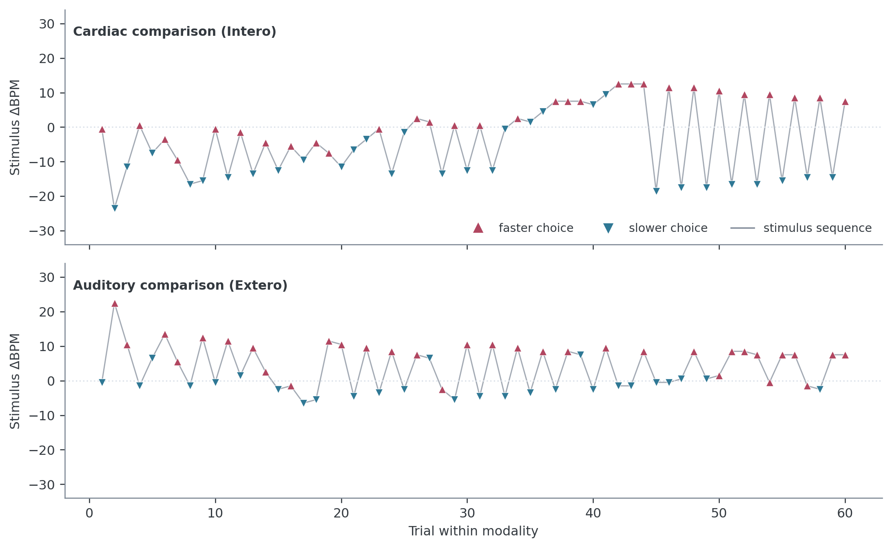
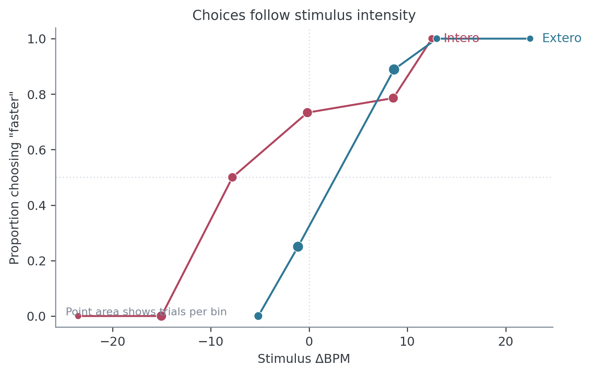
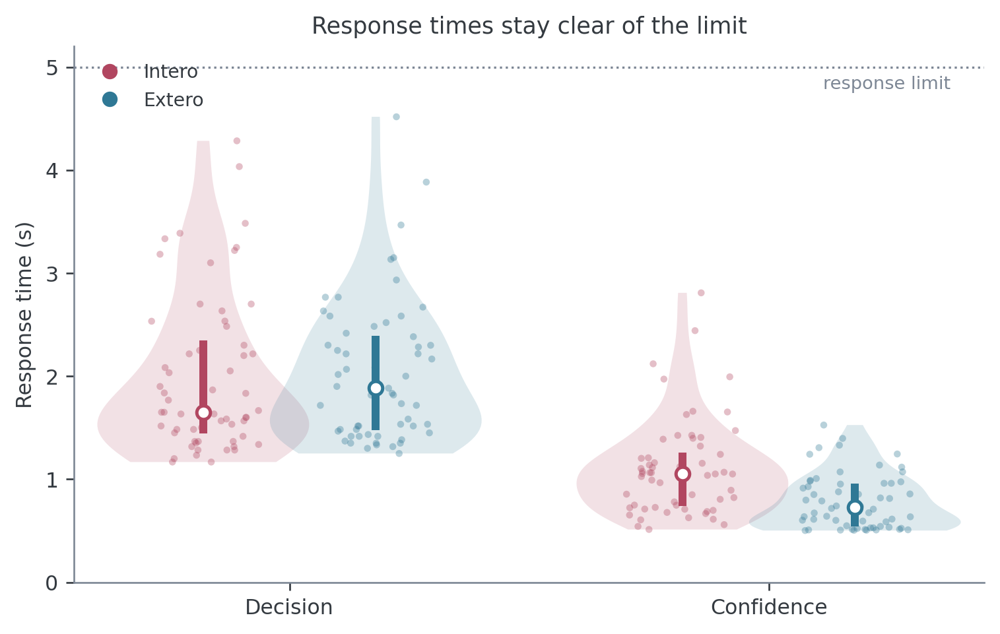
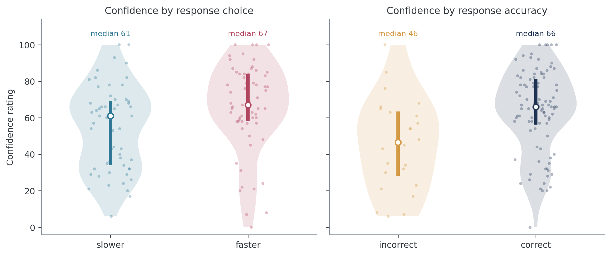
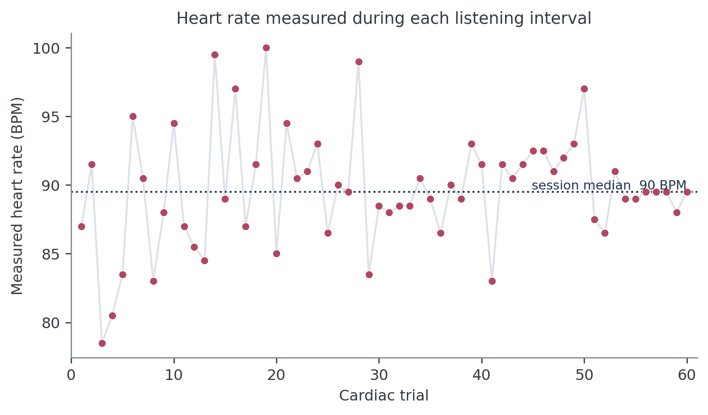
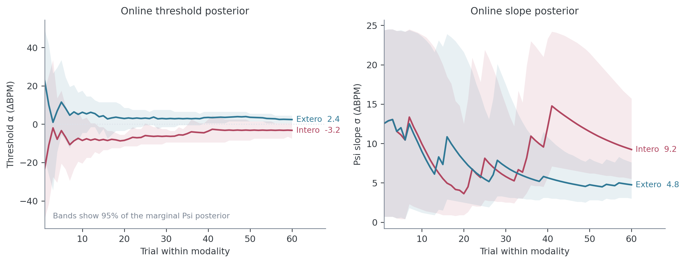
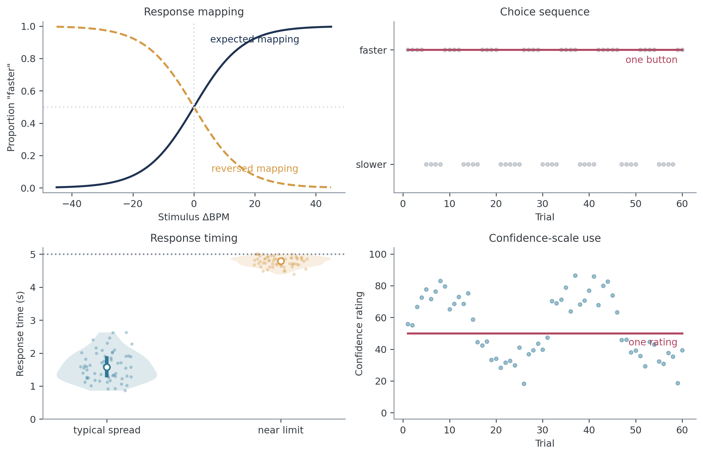
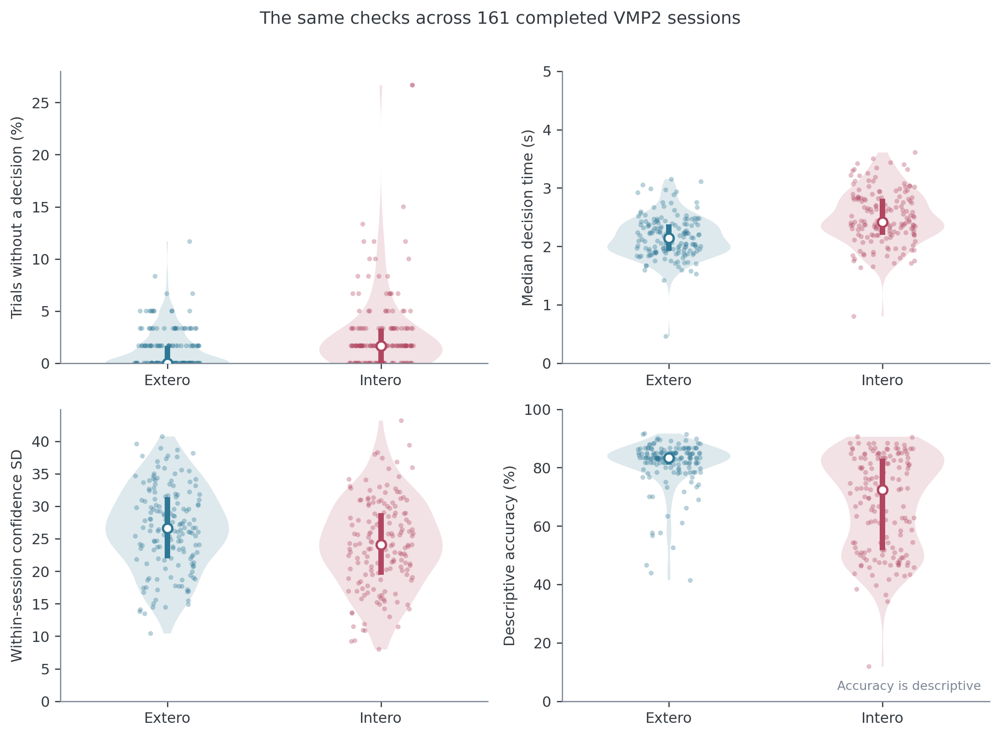

# Inspecting and plotting an HRD session

Author: Micah G. Allen

While your study is running, you should be able to open a participant's folder
and understand the session within a few minutes. This is especially important during
piloting, when an error in the instructions or response mapping can affect every
participant who follows.

The checks on this page establish whether the task completed, whether the
participant used the response and confidence scales sensibly, and whether the
adaptive procedure obtained informative data. They are descriptive checks. Any
exclusion rule should be decided for the study, documented, and applied without
reference to the result one hopes to obtain.

The figures use a deidentified participant from the VMP2 study who completed the
current Psi-only design. You can [download the example session](../examples/templates/data/HRD/vmp2_example_final.txt)
and run the code against it.

## Files in a participant folder

For a participant named `0341` in a session named `HRD`, a completed folder may
contain files like these:

```text
0341HRD/
├── 0341HRD.txt
├── 0341HRD_final.txt
├── 0341Intero_posterior.npy
├── 0341Extero_posterior.npy
├── 0341_signal.txt
├── 0341_ppg_20.txt
└── 0341_parameters.pickle
```

The raw trial log is `0341HRD.txt`. It has no `_raw` suffix. Cardioception
rewrites this file after every trial, which makes it the recovery copy if a
session is interrupted. On normal completion, the same trial table is written
as `0341HRD_final.txt`. Prefer the `_final.txt` file when it exists.

| File | What it contains | Use during collection |
|---|---|---|
| `<participant><session>.txt` | Rolling trial-level log | Recover an interrupted session |
| `*_final.txt` | Completed trial-level log | Main file for the checks on this page |
| `*Intero_posterior.npy`, `*Extero_posterior.npy` | Joint Psi posterior after each adaptive trial | Check uncertainty and parameter-grid boundaries |
| `*_signal.txt` | PPG samples collected during cardiac listening intervals, with trial numbers | Investigate suspicious trial-level heart rates |
| `*_ppg_*.txt` | Pulse-oximeter segments saved at breaks and at the end | Inspect the physiological recording in detail |
| `*_parameters.pickle` | Parameters used for that session | Confirm the intended task settings |

File names depend on the participant and session labels passed to
`getParameters()`. Match them by suffix rather than assuming a fixed prefix.

## The trial table

The final file is comma-separated despite its `.txt` extension. Each row is one
trial. We can read the columns in a few functional groups.

| Role | Columns | Interpretation |
|---|---|---|
| Design | `TrialType`, `Modality`, `nTrials` | Staircase type, cardiac or auditory condition, and zero-based trial number |
| Stimulus | `listenBPM`, `responseBPM`, `Alpha` | Reference frequency, comparison frequency, and their difference in ΔBPM |
| Behaviour | `Decision`, `ResponseCorrect`, `Confidence` | Choice, objective accuracy, and confidence from 0 to 100 |
| Completion | `DecisionProvided`, `RatingProvided`, `DecisionRT`, `ConfidenceRT` | Whether each response was made and how long it took |
| Online Psi | `EstimatedThreshold`, `EstimatedSlope` | Running means of the Psi threshold and slope posteriors |
| Event times | `StartListening` through `endTrigger` | Computer timestamps for events within the trial |

Three distinctions prevent a great deal of confusion:

- `Alpha` is `responseBPM - listenBPM`. Positive values mean the comparison
  tones were faster than the reference.
- `Decision` records which response the participant made. `More` corresponds
  to a "faster" response and `Less` to a "slower" response.
- `ResponseCorrect` compares that decision with the sign of `Alpha`. The
  psychometric model uses the decision itself because its response probability
  must increase with stimulus intensity.

`EstimatedThreshold` and `EstimatedSlope` belong to the online staircase. They
help us inspect a session and are not participant outcomes for group analysis.

## Open one completed session

Start with one file and preserve its trial order. Choose Python or R below. The
same language remains selected in the tab sets that follow.

::::{tab-set}
:::{tab-item} Python
:sync: python

```python
from pathlib import Path

import pandas as pd

session_file = Path("data/0341HRD/0341HRD_final.txt")
data = pd.read_csv(session_file).sort_values("nTrials")
data["Trial"] = data["nTrials"] + 1

print(data.shape)
data[["Trial", "Modality", "Alpha", "Decision"]].head()
```

```text
(120, 23)
   Trial Modality  Alpha Decision
0      1   Extero   -0.5     Less
1      2   Intero   -0.5     More
2      3   Intero  -23.5     Less
3      4   Intero  -11.5     Less
4      5   Extero   22.5     More
```
:::
:::{tab-item} R
:sync: r

```r
library(tidyverse)

session_file <- "data/0341HRD/0341HRD_final.txt"
data <- read_csv(session_file, show_col_types = FALSE) |>
  arrange(nTrials) |>
  mutate(Trial = nTrials + 1)

dim(data)
data |>
  select(Trial, Modality, Alpha, Decision) |>
  head()
```

```text
[1] 120  23
# A tibble: 5 × 4
  Trial Modality Alpha Decision
  <dbl> <chr>    <dbl> <chr>
1     1 Extero    -0.5 Less
2     2 Intero    -0.5 More
3     3 Intero   -23.5 Less
4     4 Intero   -11.5 Less
5     5 Extero    22.5 More
```
:::
::::

The example contains 120 rows and 23 columns. Your row count should match the
`nTrials` setting used for that study. The package default is 120, but it is not
a universal quality threshold.

## Check that the session completed

Before drawing a figure, count rows, trial numbers, modalities, and missing
responses.

::::{tab-set}
:::{tab-item} Python
:sync: python

```python
session_check = pd.Series(
    {
        "rows": len(data),
        "unique trial numbers": data["nTrials"].nunique(),
        "duplicate trial numbers": data["nTrials"].duplicated().sum(),
        "missing decisions": (~data["DecisionProvided"]).sum(),
        "missing ratings": (~data["RatingProvided"]).sum(),
    }
)
print(session_check)

by_modality = data.groupby("Modality").agg(
    trials=("nTrials", "size"),
    decisions=("DecisionProvided", "sum"),
    ratings=("RatingProvided", "sum"),
)
print(by_modality)
```

```text
rows                       120
unique trial numbers       120
duplicate trial numbers      0
missing decisions            0
missing ratings              0

          trials  decisions  ratings
Modality
Extero        60         60       60
Intero        60         60       60
```
:::
:::{tab-item} R
:sync: r

```r
tibble(
  check = c(
    "rows", "unique trial numbers", "duplicate trial numbers",
    "missing decisions", "missing ratings"
  ),
  value = c(
    nrow(data), n_distinct(data$nTrials), sum(duplicated(data$nTrials)),
    sum(!data$DecisionProvided), sum(!data$RatingProvided)
  )
)

data |>
  group_by(Modality) |>
  summarise(
    trials = n(), decisions = sum(DecisionProvided),
    ratings = sum(RatingProvided), .groups = "drop"
  )
```

```text
# A tibble: 5 × 2
  check                   value
  <chr>                   <int>
1 rows                      120
2 unique trial numbers      120
3 duplicate trial numbers     0
4 missing decisions           0
5 missing ratings             0

# A tibble: 2 × 4
  Modality trials decisions ratings
  <chr>     <int>     <int>   <int>
1 Extero       60        60      60
2 Intero       60        60      60
```
:::
::::

The worked session has 60 trials in each modality and no missing responses.
Ratings are not presented when the decision is missing, so the two missingness
counts will often move together.

A missed decision has no psychophysical response. Leave it missing and remove
it from later modelling. Recoding it as `Less` or as an incorrect response would
invent an observation.

## Plot the stimulus and response trace

The stimulus trace is the most informative first plot. Separate the two
modalities because each has its own Psi staircase. Within each modality, count
trials in the order they occurred.

::::{tab-set}
:::{tab-item} Python
:sync: python

```python
import matplotlib.pyplot as plt

data["adaptive_trial"] = data.groupby("Modality").cumcount() + 1
data["choice"] = data["Decision"].map({"More": "faster", "Less": "slower"})

fig, axes = plt.subplots(2, 1, figsize=(8, 5), sharex=True, sharey=True)
for ax, modality in zip(axes, ["Intero", "Extero"]):
    d = data[data["Modality"] == modality]
    ax.plot(d["adaptive_trial"], d["Alpha"], color="0.7", linewidth=1)
    for choice, marker, colour in [
        ("faster", "^", "#B14660"),
        ("slower", "v", "#2F7895"),
    ]:
        q = d[d["choice"] == choice]
        ax.scatter(q["adaptive_trial"], q["Alpha"], marker=marker,
                   color=colour, label=choice)
    ax.axhline(0, color="0.8", linestyle=":")
    ax.set(title=modality, ylabel="Stimulus ΔBPM")

axes[-1].set_xlabel("Trial within modality")
axes[0].legend(frameon=False)
plt.tight_layout()
```
:::
:::{tab-item} R
:sync: r

```r
trace <- data |>
  group_by(Modality) |>
  mutate(
    adaptive_trial = row_number(),
    choice = recode(Decision, More = "faster", Less = "slower")
  ) |>
  ungroup()

ggplot(trace, aes(adaptive_trial, Alpha)) +
  geom_hline(yintercept = 0, colour = "grey80", linetype = "dotted") +
  geom_line(colour = "grey70") +
  geom_point(aes(colour = choice, shape = choice), size = 2) +
  facet_wrap(~ Modality, ncol = 1) +
  scale_colour_manual(values = c(faster = "#B14660", slower = "#2F7895")) +
  labs(x = "Trial within modality", y = "Stimulus ΔBPM") +
  theme_classic()
```
:::
::::



This participant's choices change with ΔBPM in both conditions. The cardiac
staircase explores mostly negative values early and alternates between positive
and negative regions later. The alternation is a consequence of selecting
informative stimuli for both threshold and slope. A healthy Psi trace does not
have to become flat.

Traces deserve investigation when they remain at a stimulus boundary, contain
large stretches with no valid response, or show little correspondence between
stimulus intensity and choice. Movement alone is expected.

## Relate choices to stimulus intensity

The staircase trace shows when each stimulus was presented. The response plot
asks whether increasing ΔBPM produced more "faster" choices. This is the
relationship that the psychometric function will model.

The plot below bins intensity for display. Point area records the number of
trials in each bin, which matters because an adaptive staircase samples the
range unevenly.

::::{tab-set}
:::{tab-item} Python
:sync: python

```python
import numpy as np
import seaborn as sns

valid = data[data["Decision"].isin(["More", "Less"])].copy()
valid["faster"] = valid["Decision"].eq("More").astype(int)
valid["intensity_bin"] = pd.cut(
    valid["Alpha"], bins=np.arange(-44, 45, 8), include_lowest=True
)

response_plot = (
    valid.groupby(["Modality", "intensity_bin"], observed=True)
    .agg(
        intensity=("Alpha", "mean"),
        proportion_faster=("faster", "mean"),
        trials=("faster", "size"),
    )
    .reset_index()
)

sns.lineplot(
    data=response_plot, x="intensity", y="proportion_faster",
    hue="Modality", marker="o",
)
plt.axhline(0.5, color="0.8", linestyle=":")
plt.xlabel("Stimulus ΔBPM")
plt.ylabel('Proportion choosing "faster"')
```
:::
:::{tab-item} R
:sync: r

```r
response_plot <- data |>
  filter(Decision %in% c("More", "Less")) |>
  mutate(
    faster = as.integer(Decision == "More"),
    intensity_bin = cut_width(Alpha, width = 8, boundary = 0)
  ) |>
  group_by(Modality, intensity_bin) |>
  summarise(
    intensity = mean(Alpha),
    proportion_faster = mean(faster),
    trials = n(),
    .groups = "drop"
  )

ggplot(response_plot, aes(intensity, proportion_faster, colour = Modality)) +
  geom_hline(yintercept = 0.5, colour = "grey80", linetype = "dotted") +
  geom_line() +
  geom_point(aes(size = trials)) +
  labs(x = "Stimulus ΔBPM", y = "Proportion \"faster\"") +
  theme_classic()
```
:::
::::



The two response curves rise from left to right in the worked session. Their
horizontal displacement is scientifically meaningful. A participant can use
the response mapping consistently while having a threshold away from zero.

Binning is useful for this picture only. Keep the exact `Alpha` values when you
fit a model.

### Accuracy is a secondary description

Accuracy is worth printing because it can reveal a gross instruction or response
mapping problem.

::::{tab-set}
:::{tab-item} Python
:sync: python

```python
data.groupby("Modality")["ResponseCorrect"].agg(["count", "mean"])
```

```text
          count      mean
Modality
Extero       60  0.833333
Intero       60  0.766667
```
:::
:::{tab-item} R
:sync: r

```r
data |>
  group_by(Modality) |>
  summarise(trials = sum(!is.na(ResponseCorrect)),
            accuracy = mean(ResponseCorrect, na.rm = TRUE))
```

```text
# A tibble: 2 × 3
  Modality trials accuracy
  <chr>     <int>    <dbl>
1 Extero       60    0.833
2 Intero       60    0.767
```
:::
::::

The worked participant was correct on 77% of cardiac trials and 83% of auditory
trials. These values describe the session without defining successful HRD
performance. Psi concentrates trials around the point of subjective equality;
it does not target a fixed proportion correct. Bias therefore changes which
side of objective zero the participant sees most often.

## Inspect response times

Plot decision and confidence response times together so that their different
time scales remain visible. Individual trials should remain visible beneath the
distributions.

The current defaults allow 5 seconds for each response and require at least 0.5
seconds for a confidence rating.

::::{tab-set}
:::{tab-item} Python
:sync: python

```python
rt = data.melt(
    id_vars=["Modality"],
    value_vars=["DecisionRT", "ConfidenceRT"],
    var_name="response", value_name="seconds",
).dropna()

sns.violinplot(data=rt, x="response", y="seconds", hue="Modality",
               inner="quart", cut=0)
sns.stripplot(data=rt, x="response", y="seconds", hue="Modality",
              dodge=True, palette={"Intero": "#B14660", "Extero": "#2F7895"},
              alpha=0.25)
plt.axhline(5, color="0.5", linestyle=":")
handles, labels = plt.gca().get_legend_handles_labels()
plt.legend(handles[:2], labels[:2], frameon=False)
```
:::
:::{tab-item} R
:sync: r

```r
rt <- data |>
  pivot_longer(c(DecisionRT, ConfidenceRT),
               names_to = "response", values_to = "seconds") |>
  filter(!is.na(seconds))

ggplot(rt, aes(response, seconds, fill = Modality)) +
  geom_violin(position = position_dodge(width = 0.8), trim = TRUE) +
  geom_point(
    aes(colour = Modality), alpha = 0.25,
    position = position_jitterdodge(jitter.width = 0.08, dodge.width = 0.8)
  ) +
  geom_hline(yintercept = 5, colour = "grey50", linetype = "dotted") +
  labs(x = NULL, y = "Response time (s)") +
  theme_classic()
```
:::
::::



Look for a pile-up near the response limit, many missing responses, or a sharp
change after a break. Very short response times can indicate anticipatory key
presses. Slow responses can reflect genuine difficulty or accessibility needs,
so investigate the session context before defining any exclusion.

## Inspect confidence in two ways

A confidence histogram answers whether the participant used the slider. Two
comparisons are more informative during piloting. Separating confidence by
choice can expose a response-linked confidence bias. Separating it by objective
accuracy gives a first descriptive view of whether confidence tracked trial
outcome.

::::{tab-set}
:::{tab-item} Python
:sync: python

```python
valid["choice"] = valid["Decision"].map({"More": "faster", "Less": "slower"})
valid["accuracy"] = valid["ResponseCorrect"].map(
    {True: "correct", False: "incorrect"}
)

fig, axes = plt.subplots(1, 2, figsize=(8, 3.5), sharey=True)
for ax, column, order in [
    (axes[0], "choice", ["slower", "faster"]),
    (axes[1], "accuracy", ["incorrect", "correct"]),
]:
    sns.violinplot(data=valid, x=column, y="Confidence", order=order,
                   inner="quart", cut=0, ax=ax)
    sns.stripplot(data=valid, x=column, y="Confidence", order=order,
                  color="0.25", alpha=0.3, ax=ax)
axes[0].set_title("Confidence by response choice")
axes[1].set_title("Confidence by response accuracy")
```
:::
:::{tab-item} R
:sync: r

```r
valid <- data |>
  filter(Decision %in% c("More", "Less"), !is.na(Confidence)) |>
  mutate(
    choice = recode(Decision, More = "faster", Less = "slower"),
    accuracy = factor(ResponseCorrect, levels = c(FALSE, TRUE),
                      labels = c("incorrect", "correct"))
  )

choice_plot <- ggplot(valid, aes(choice, Confidence)) +
  geom_violin(fill = "grey90", colour = NA, trim = TRUE) +
  geom_jitter(width = 0.08, alpha = 0.3) +
  theme_classic()

accuracy_plot <- ggplot(valid, aes(accuracy, Confidence)) +
  geom_violin(fill = "grey90", colour = NA, trim = TRUE) +
  geom_jitter(width = 0.08, alpha = 0.3) +
  theme_classic()
```
:::
::::



In this session, median confidence was 61 after "slower" choices and 67 after
"faster" choices. The larger difference is between incorrect and correct trials,
with medians of 46 and 66. Keep the individual observations in view because a
mean or median cannot show whether the participant used only one point on the
scale.

Also record scale usage and mass at the bounds:

::::{tab-set}
:::{tab-item} Python
:sync: python

```python
print(f"Unique ratings: {valid['Confidence'].nunique()}")
print(f"At 0 or 100: {valid['Confidence'].isin([0, 100]).mean():.1%}")
```

```text
Unique ratings: 65
At 0 or 100: 5.8%
```
:::
:::{tab-item} R
:sync: r

```r
n_distinct(valid$Confidence)
mean(valid$Confidence %in% c(0, 100))
```

```text
[1] 65
[1] 0.05833333
```
:::
::::

Seven ratings in the worked session, or 5.8%, lie exactly at 0 or 100. Bound
responses are valid uses of the scale. Formal analysis retains them with ordered
beta regression, as explained in the [metacognition tutorial](metacognition.md).

## Check the trial-level heart rate

For cardiac trials, `listenBPM` is the heart rate estimated during the listening
interval. A quick trace can reveal gross recording problems before you inspect
the PPG itself.

::::{tab-set}
:::{tab-item} Python
:sync: python

```python
heart = data[data["Modality"] == "Intero"]
sns.lineplot(data=heart, x="adaptive_trial", y="listenBPM", marker="o")
plt.xlabel("Cardiac trial")
plt.ylabel("Measured heart rate (BPM)")
```
:::
:::{tab-item} R
:sync: r

```r
data |>
  filter(Modality == "Intero") |>
  mutate(adaptive_trial = row_number()) |>
  ggplot(aes(adaptive_trial, listenBPM)) +
  geom_line() + geom_point() +
  labs(x = "Cardiac trial", y = "Measured heart rate (BPM)") +
  theme_classic()
```
:::
::::



Sudden jumps, repeated boundary values, or an implausibly flat trace justify a
closer look at `*_signal.txt` and the saved PPG segments. Trial-level heart rate
cannot show whether individual pulse peaks were detected correctly. It is a
screening plot rather than a signal-quality analysis.

As a basic consistency check, `responseBPM - listenBPM` should equal `Alpha`:

::::{tab-set}
:::{tab-item} Python
:sync: python

```python
np.allclose(data["responseBPM"] - data["listenBPM"], data["Alpha"])
```

```text
True
```
:::
:::{tab-item} R
:sync: r

```r
all.equal(data$responseBPM - data$listenBPM, data$Alpha)
```

```text
[1] TRUE
```
:::
::::

## Inspect the Psi posterior

The two `_posterior.npy` files retain the joint probability distribution over
threshold and slope after every trial. The trial table contains the corresponding
posterior means in `EstimatedThreshold` and `EstimatedSlope`.

At the beginning of this session, most of the parameter grid remains plausible.
The posterior narrows as responses accumulate. After 60 trials per modality, the
online means are -3.2 ΔBPM for the cardiac threshold and +2.4 ΔBPM for the
auditory threshold. The online Psi slope, denoted $\sigma$, ends at 9.2 ΔBPM for
cardiac trials and 4.8 ΔBPM for auditory trials.

Larger $\sigma$ means a shallower response transition and poorer discrimination.
The offline `brms` model uses a different slope parameterization; the
[psychophysical model tutorial](psychophysics.md) explains the conversion.

For a quick point-estimate plot in either language:

::::{tab-set}
:::{tab-item} Python
:sync: python

```python
for modality, d in data.groupby("Modality"):
    plt.plot(d["adaptive_trial"], d["EstimatedThreshold"], label=modality)
plt.axhline(0, color="0.8", linestyle=":")
plt.xlabel("Trial within modality")
plt.ylabel("Online threshold estimate (ΔBPM)")
plt.legend(frameon=False)
```
:::
:::{tab-item} R
:sync: r

```r
data |>
  group_by(Modality) |>
  mutate(adaptive_trial = row_number()) |>
  ggplot(aes(adaptive_trial, EstimatedThreshold, colour = Modality)) +
  geom_hline(yintercept = 0, colour = "grey80", linetype = "dotted") +
  geom_line() +
  labs(x = "Trial within modality",
       y = "Online threshold estimate (ΔBPM)") +
  theme_classic()
```
:::
::::



The shaded intervals in the tutorial figure come from the `.npy` arrays. The
reproducible code is in [`tutorials/plot_inspecting_data.py`](https://github.com/embodied-computation-group/Cardioception/blob/tutorial-dev/tutorials/plot_inspecting_data.py).

The posterior centre can move sharply after an informative response, and its
uncertainty need not shrink on every trial. More concerning patterns include a
threshold posterior that remains pressed against the -50.5 or +50.5 ΔBPM grid
boundary, or a slope posterior that retains substantial mass at the upper
25 ΔBPM boundary near the end of the session.

Use these quantities to diagnose stimulus placement and parameter-range
problems. Fit the raw choices and exact intensities for scientific inference.
Do not compare final `EstimatedThreshold` or `EstimatedSlope` values in a group
test.

## Recognize patterns that need follow-up

Quality-control plots are most useful when we know what would count as unusual.
The examples below are schematic, so that the pattern is easier to see than it
would be in a noisy single session.



The expected response curve rises with ΔBPM. If it falls consistently, first
check that `More` and `Less` were decoded correctly in the analysis. If the code
is correct, review the response mapping and the participant's account of the
instructions. A displaced but still rising curve can reflect a genuine
perceptual bias and should not be mistaken for reversed buttons.

A session containing almost entirely one choice is also worth opening. It may
reflect a misunderstood instruction, an unregistered key, or disengagement.
The same applies when confidence remains at one rating throughout the task. In
both cases, check the trial log and acquisition notes before deciding what the
pattern means.

Response times clustered against the configured limit suggest that the response
window may have been too short or that the participant struggled with the task.
An unusually slow participant is not automatically invalid. The useful question
is whether responses were recorded reliably and whether the timing matches what
happened during the session.

Finally, inspect responses at the largest absolute values of `Alpha`. With the
current default grid, `Alpha` runs from -50.5 to +50.5 ΔBPM. A "slower" response
at approximately +50 ΔBPM is unlikely, but one such trial can be an ordinary
lapse. Repeated contradictions at both ends of the range, or a response curve
that decreases with intensity, provide stronger evidence of a mapping problem.
`responseBPM = 120` records an absolute comparison-tone rate, not a difference
of 120 BPM. The relevant difference from the reference appears in `Alpha`.

These plots generate questions rather than exclusions. Decide exclusion rules
before the main analysis, and preserve the raw pattern that motivated each rule.

## Review sessions as data accumulate

Once several participants have completed the task, pool the final files and
compare the same session-level summaries. This helps find unusual sessions while
there is still time to inspect the acquisition notes.

::::{tab-set}
:::{tab-item} Python
:sync: python

```python
files = sorted(Path("data").glob("**/*_final.txt"))
frames = []
for file in files:
    frame = pd.read_csv(file)
    frame["Subject"] = file.parent.name
    frame["source_file"] = str(file)
    frames.append(frame)

study = pd.concat(frames, ignore_index=True)
study["missed_decision"] = ~study["DecisionProvided"]

session_summary = (
    study.groupby(["Subject", "source_file", "Modality"])
    .agg(
        trials=("nTrials", "size"),
        missed_decisions_percent=("missed_decision", lambda x: 100 * x.mean()),
        median_decision_rt=("DecisionRT", "median"),
        confidence_sd=("Confidence", "std"),
        accuracy_percent=("ResponseCorrect", lambda x: 100 * x.mean()),
    )
    .reset_index()
)

summary_long = session_summary.melt(
    id_vars=["Subject", "Modality"],
    value_vars=[
        "missed_decisions_percent", "median_decision_rt",
        "confidence_sd", "accuracy_percent",
    ],
    var_name="metric", value_name="value",
)

sns.catplot(
    data=summary_long, x="Modality", y="value",
    col="metric", col_wrap=2, sharey=False,
    kind="strip", alpha=0.45,
)
```
:::
:::{tab-item} R
:sync: r

```r
files <- list.files(
  "data", pattern = "_final\\.txt$", recursive = TRUE, full.names = TRUE
)

study <- map_dfr(files, function(file) {
  read_csv(file, show_col_types = FALSE) |>
    mutate(Subject = basename(dirname(file)), source_file = file)
})

session_summary <- study |>
  group_by(Subject, source_file, Modality) |>
  summarise(
    trials = n(),
    missed_decisions_percent = 100 * mean(!DecisionProvided),
    median_decision_rt = median(DecisionRT, na.rm = TRUE),
    confidence_sd = sd(Confidence, na.rm = TRUE),
    accuracy_percent = 100 * mean(ResponseCorrect, na.rm = TRUE),
    .groups = "drop"
  )

summary_long <- session_summary |>
  pivot_longer(
    c(
      missed_decisions_percent, median_decision_rt,
      confidence_sd, accuracy_percent
    ),
    names_to = "metric", values_to = "value"
  )

ggplot(summary_long, aes(Modality, value, colour = Modality)) +
  geom_jitter(width = 0.12, alpha = 0.45) +
  facet_wrap(~ metric, scales = "free_y") +
  guides(colour = "none") +
  labs(x = NULL, y = NULL) +
  theme_classic()
```
:::
::::



This figure contains 161 completed, Psi-only VMP2 sessions. Each point represents
one participant and modality. Most sessions have few missed decisions, while a
small number stand well outside the main distribution. Those points tell us
which trial traces and session notes to inspect first. They do not define an
automatic exclusion threshold. Accuracy remains descriptive because Psi does
not target a fixed proportion correct.

## A practical collection checklist

These checks form a useful specification for a future automated report.

| Question | Evidence to inspect |
|---|---|
| Did the task finish? | `_final.txt` exists, row count matches the study settings, trial numbers are unique |
| Were responses recorded? | `DecisionProvided`, `RatingProvided`, missing reaction times |
| Did choices use the stimulus information? | Stimulus trace and proportion "faster" across ΔBPM |
| Was timing appropriate? | Decision and confidence response-time distributions relative to configured limits |
| Was the confidence scale used? | Unique values, mass at 0 and 100, distributions by choice and accuracy |
| Did cardiac measurement look plausible? | `listenBPM` trace, followed by PPG inspection when needed |
| Did Psi learn within its grid? | Threshold and slope trajectories with posterior intervals and boundary checks |

The legacy `cardioception.reports.preprocessing` and
`cardioception.reports.report` helpers are being deprecated. They mix quality
control with outdated analysis choices, so this tutorial does not use them. A
rebuilt report can later automate the checks above while keeping the trial data
and diagnostic plots visible.

The next tutorial explains [what the psychophysical model measures](psychophysics.md)
and fits one participant's trial-level responses.
