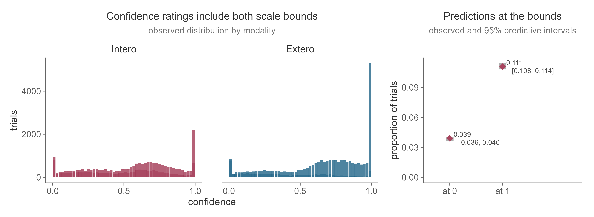
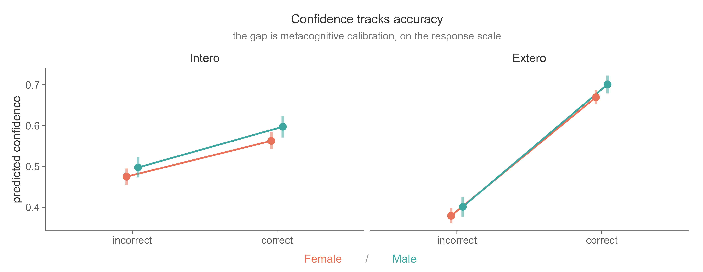
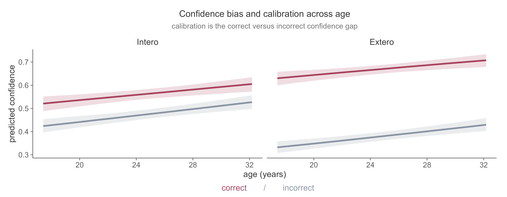

# Metacognition

Author: Micah G. Allen

The Heart Rate Discrimination task records a confidence rating after every
choice. These ratings let us ask whether participants know when their judgements
are likely to be correct. This is a separate question from whether they can
discriminate changes in heart rate.

The [previous tutorial](hierarchical.md) used faster and slower choices to
estimate psychophysical bias, precision, and lapse rate. Here we fit a second
hierarchical model in which confidence is the outcome. The principles of partial
pooling and random effects remain the same, but the likelihood and the
scientific interpretation are different.

## Confidence bias and metacognitive calibration

We use the confidence ratings to distinguish two quantities.

- Confidence bias describes how participants use the rating scale. A participant
  may tend to report high or low confidence regardless of whether a response was
  correct.

- Metacognitive calibration describes the association between confidence and
  accuracy. In this tutorial, it is the difference in expected confidence between
  correct and incorrect trials.

These quantities can vary independently. A participant can be confident but
poorly calibrated, or cautious while still assigning higher confidence to their
correct responses. In the regression model, the intercept and other main effects
describe confidence bias, while the coefficient for `Accuracy` describes
calibration in the reference condition. Interactions with `Accuracy` test whether
calibration changes across conditions or participant characteristics.

We reserve the terms metacognitive sensitivity and metacognitive efficiency for
signal detection measures such as meta-d-prime and M-ratio. Ordered beta
regression does not fit a signal detection model, so calibration is the more
accurate name for the quantity estimated here.

## The confidence distribution determines the likelihood

Confidence is recorded on a continuous slider from 0 to 100. Participants can
select either endpoint, and those observations are meaningful. In the example
data, 15.0% of ratings fall exactly on a bound, with 3.9% at zero and 11.1% at
100.



Several familiar likelihoods are poorly suited to these data.

| Likelihood | Problem for HRD confidence |
|---|---|
| Gaussian | Assigns probability to values below 0 and above 1 |
| Beta | Excludes observations at exactly 0 and 1 |
| Ordinal after binning | Discards the resolution of the confidence slider |

Ordered beta regression retains the continuous ratings and their exact bounds
([Kubinec, 2023](https://doi.org/10.1017/pan.2022.20)). It models zero, the open
interval between zero and one, and one within a single likelihood. Two ordered
cutpoints govern the probability of a response at either bound, while a beta
distribution describes ratings in the interior. We therefore do not need to
move endpoint ratings inward or convert the scale into categories.

The right panel above is an important posterior predictive check. A suitable
model should reproduce both the interior distribution and the observed
proportions at zero and one.

## Why we do not use M-ratio for HRD data

M-ratio, defined as meta-d-prime divided by d-prime, is a useful measure of
metacognitive efficiency for experiments that support its signal detection
assumptions. The HRD design creates a specific problem for that analysis.

The Psi staircase places trials near each participant's point of subjective
equality. It is designed to estimate the cardiac bias described in the
[psychophysics tutorial](psychophysics.md), rather than to maintain a fixed
level of objective accuracy. Accuracy is nevertheless scored relative to the
participant's measured heart rate. A faster response is correct above zero
delta BPM, and a slower response is correct below zero.

Consider a participant with a threshold of -15 delta BPM. The staircase will
present many trials near -15 because this is where their faster and slower
responses are balanced. Most of those trials have slower as the objectively
correct answer. The two stimulus classes required to estimate type 1 hit and
false alarm rates are consequently very uneven. For participants with large
cardiac biases, one class may contain only a few trials.

Under this design, d-prime also combines response bias with psychophysical
precision. Dividing meta-d-prime by d-prime would reintroduce a distinction that
the psychometric model was used to resolve. Finally, estimating meta-d-prime
requires us to bin the continuous confidence ratings, making the result depend
on arbitrary cutpoints.

This argument is specific to the task design. M-ratio remains appropriate for
experiments with adequately sampled stimulus classes, suitable control over type
1 performance, and confidence ratings designed for an SDT analysis. For HRD, we
model the trial-level confidence ratings directly and describe the
accuracy-confidence association as metacognitive calibration.

## Prepare trial-level confidence data

Begin with the trial data described in the [inspection
tutorial](inspecting-data.md). Remove trials without a decision or confidence
rating, preserve the exact slider endpoints, and code incorrect trials as the
reference level.

```r
library(dplyr)

confidence_data <- raw |>
  filter(
    Decision %in% c("More", "Less"),
    !is.na(Confidence),
    !is.na(ResponseCorrect)
  ) |>
  mutate(
    subj = factor(Subject),
    Accuracy = factor(
      if_else(
        tolower(as.character(ResponseCorrect)) %in% c("true", "1"),
        "correct",
        "incorrect"
      ),
      levels = c("incorrect", "correct")
    ),
    Modality = factor(Modality, levels = c("Extero", "Intero")),
    Confidence = Confidence / 100
  )

stopifnot(all(confidence_data$Confidence >= 0 &
              confidence_data$Confidence <= 1))
```

Do not recode a missed decision as incorrect. There is no choice to score on
such a trial. Before fitting the model, inspect the range and scale use for each
participant.

```r
confidence_data |>
  group_by(subj) |>
  summarise(
    trials = n(),
    mean_confidence = mean(Confidence),
    sd_confidence = sd(Confidence),
    at_zero = mean(Confidence == 0),
    at_one = mean(Confidence == 1),
    .groups = "drop"
  )
```

A participant who selected one confidence value throughout the task provides no
within-person information about calibration. Review these sessions before
analysis and document any exclusion rule. Scale use is also worth plotting,
because a standard deviation alone does not show whether a participant relied
almost entirely on one endpoint.

The worked model also uses gender, age, and BMI. Set the gender reference level
and join the participant-level standardized age and BMI variables prepared in
the [hierarchical modelling tutorial](hierarchical.md). Standardize these
variables over one row per participant, rather than over the trial table.

## Specify the hierarchical ordered beta model

A useful starting model is

```text
Confidence ~ Accuracy + (Accuracy | subj)
```

The population coefficient for `Accuracy` estimates average metacognitive
calibration. The participant intercepts allow confidence bias to vary, and the
participant slopes allow the accuracy-confidence association to vary. Partial
pooling regularizes both estimates.

The worked example extends this model to ask whether calibration differs between
the cardiac and exteroceptive conditions, between genders, or with age. BMI is
included as a covariate.

```r
library(brms)
library(ordbetareg)

confidence_formula <- bf(
  Confidence ~ Accuracy * (Modality + gender + age_z) + bmi_z +
    (Accuracy * Modality | subj)
)

fit_confidence <- ordbetareg(
  formula = confidence_formula,
  data = confidence_data,
  chains = 4,
  cores = 4,
  control = list(adapt_delta = 0.95, max_treedepth = 12),
  file = "fit_confidence"
)
```

`Accuracy` and `Modality` vary within participants, so the model includes their
random slopes and interaction. Gender, age, and BMI vary between participants
and cannot receive participant-level random slopes. The same design rule is
explained in the [hierarchical modelling tutorial](hierarchical.md).

The worked model uses the package defaults for its priors. For a new study, use
`get_prior()` to inspect the parameters created by your exact formula and carry
out prior predictive checks before sampling. Ordered beta models can take
several hours to fit, so cache the model with `file` and begin with a small test
run to identify coding problems.

## Interpret interactions through predictions

Regression coefficients are reported on the model's latent scale. Their meaning
also depends on the reference levels and interactions in the formula.

| Term | Interpretation in the worked model |
|---|---|
| `Accuracycorrect` | Calibration for Extero trials among participants at the reference levels of the other predictors |
| `ModalityIntero` | Intero versus Extero difference on incorrect trials |
| `Accuracycorrect:ModalityIntero` | Change in calibration from Extero to Intero trials |
| `age_z` | Association between age and confidence on incorrect trials |
| `Accuracycorrect:age_z` | Association between age and calibration |

The main effect of `Modality` is therefore not an overall modality difference,
and the main effect of age is not an overall age effect. Once interactions are
present, we should use posterior predictions to express the result on the
confidence scale.

```r
library(marginaleffects)

# Expected confidence for each accuracy by modality combination
avg_predictions(
  fit_confidence,
  by = c("Accuracy", "Modality")
)

# Correct minus incorrect confidence within each modality
avg_comparisons(
  fit_confidence,
  variables = "Accuracy",
  by = "Modality"
)
```

These summaries average over the requested observations. For a continuous
moderator such as age, create a grid over the observed age range and plot the
predictions for correct and incorrect trials. The distance between those lines
is calibration.

## Results from the worked model

The example model was fitted to 68,932 trials from 512 participants. The table
shows selected population coefficients on the latent scale.

| Term | Estimate | 95% interval |
|---|---:|---:|
| `Accuracycorrect` | 1.09 | [1.03, 1.15] |
| `ModalityIntero` | 0.36 | [0.30, 0.41] |
| `Accuracycorrect:ModalityIntero` | -0.76 | [-0.83, -0.70] |
| `age_z` | 0.13 | [0.08, 0.18] |
| `Accuracycorrect:age_z` | -0.02 | [-0.06, 0.02] |
| `genderMale` | 0.08 | [-0.02, 0.19] |
| `Accuracycorrect:genderMale` | 0.05 | [-0.04, 0.13] |

The response-scale predictions make these coefficients easier to interpret.



For women at the mean age and BMI, expected confidence on Extero trials was
0.67 after correct responses and 0.38 after incorrect responses. The calibration
gap was therefore 0.29. On Intero trials, the corresponding predictions were
0.56 and 0.47, giving a gap of 0.09. The negative
`Accuracycorrect:ModalityIntero` interaction captures this reduction in cardiac
metacognitive calibration.

Notice how the modality comparison changes with accuracy. Predicted confidence
was higher for Intero than Extero trials following an incorrect response, but
lower following a correct response. Reporting `ModalityIntero` as an overall
increase in cardiac confidence would miss this interaction. The estimated
gender interaction was small and its interval included zero, so this analysis
provides little evidence that calibration differed by gender.

### Age and confidence bias



Expected confidence increased with age for both correct and incorrect trials.
The two lines remained approximately parallel, and the interval for
`Accuracycorrect:age_z` included zero. In this sample, age was associated with
confidence bias but provided little evidence of a change in metacognitive
calibration. This is why we examine the predicted confidence levels and their
gap separately.

## Check the fitted model

Begin with the standard sampling diagnostics. Check for divergent transitions,
verify that R-hat is below 1.01, and inspect effective sample sizes and trace
plots. If the model has convergence problems, do not interpret its coefficients.

Posterior predictive checks should then address the features that motivated the
likelihood.

- Compare predicted and observed confidence distributions within each modality
  and accuracy condition.

- Compare the predicted and observed proportions at exactly zero and one.

- Check whether the model reproduces large differences in scale use between
  participants.

- Plot participant-level predictions to identify sessions that the population
  model describes poorly.

The first figure on this page illustrates the bound check. The observed
proportions should fall within plausible posterior predictive intervals. A
density plot of the interior ratings cannot establish this on its own.

## Report the model and result

A clear report should state the number of participants and trials, the amount of
confidence mass at both bounds, the fixed and random effect formula, the priors,
and the sampling and posterior predictive diagnostics. Report the scientific
result as response-scale expected confidence and calibration contrasts with
uncertainty for each condition of interest. Latent coefficients can accompany
these summaries, but should not replace them.

The two hierarchical tutorials now provide complementary descriptions of HRD
performance. The [psychophysical model](hierarchical.md) estimates cardiac bias,
precision, and lapse rate from choices. The ordered beta model estimates
confidence bias and metacognitive calibration from ratings. The [theory
page](../measuring.md) explains how these measurements fit into the broader
account of cardiac interoception.
