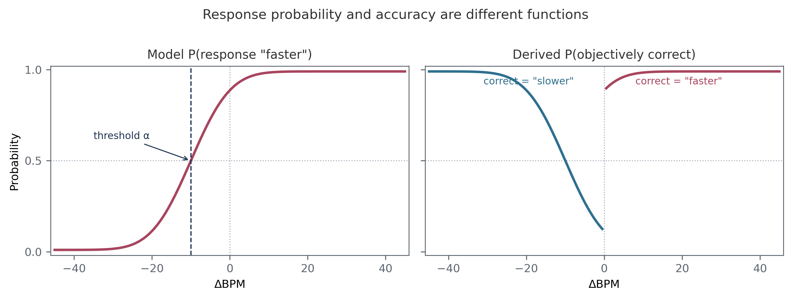
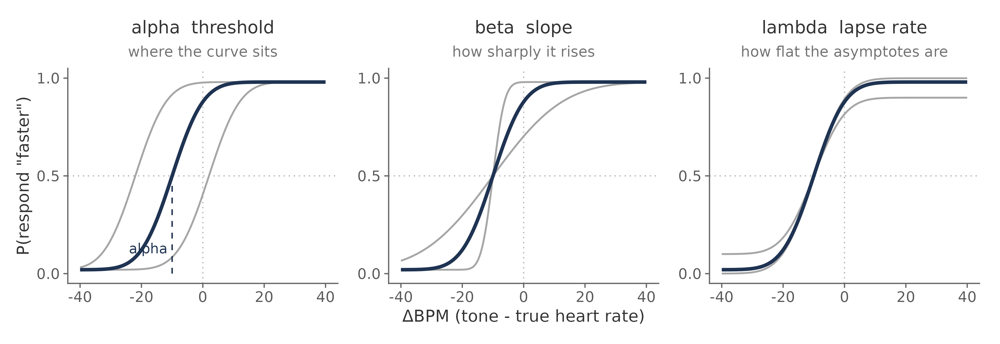
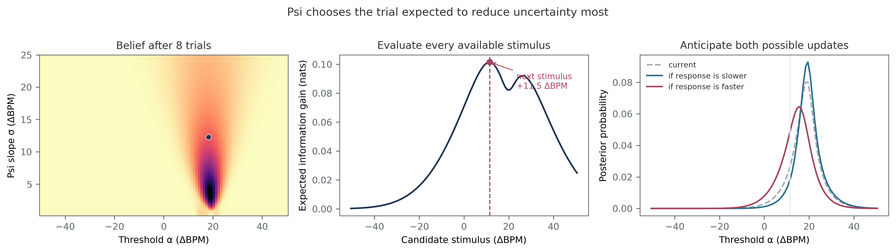
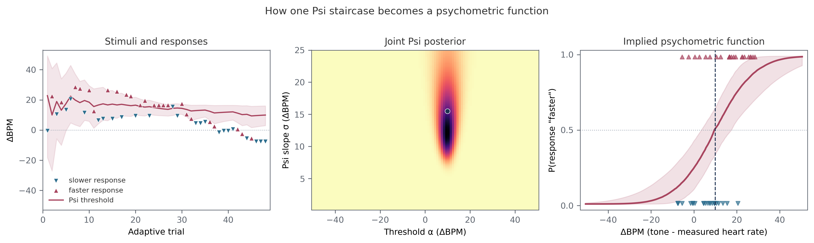
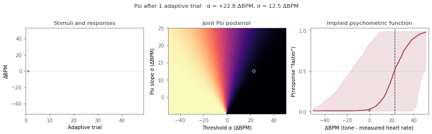
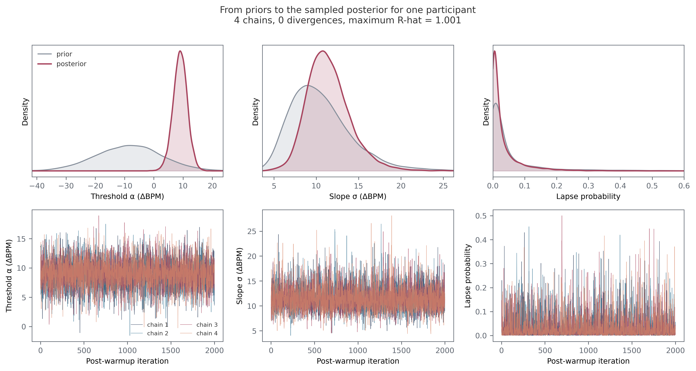
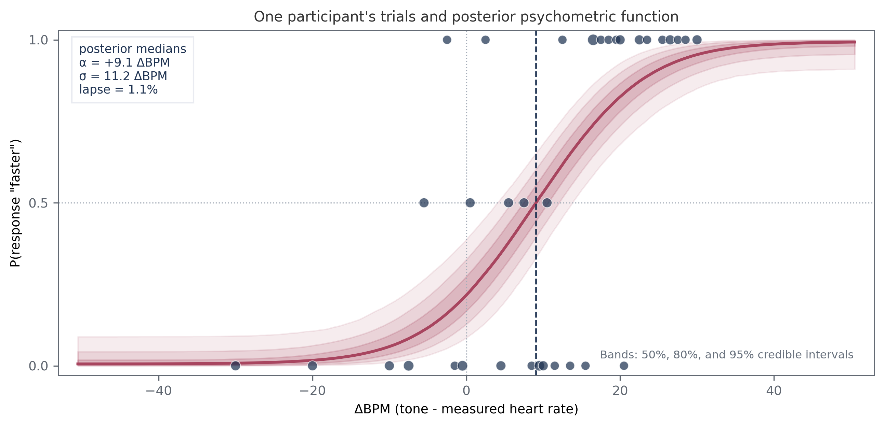

# The psychophysical model

Author: Micah G. Allen

The Heart Rate Discrimination task turns a simple judgement into a model of
cardiac belief. A participant attends to their heart, hears a sequence of tones,
and reports whether the tones were faster or slower. Across trials, we vary the
difference between the tones and the measured heart rate. The pattern of
responses tells us where the participant believes their heart rate lies and how
precisely they can discriminate changes around that belief.

There are two Bayesian procedures in this workflow. Psi runs during the task and
chooses informative stimuli. We then refit the response model in `brms`, where
we can estimate lapse rate, use cleaned trials, and retain posterior uncertainty.
The two procedures use closely related psychometric functions, but they have
different jobs.

This tutorial is organized accordingly:

1. the measurement model and its psychological interpretation;
2. adaptive measurement with Psi;
3. a worked `brms` analysis of one participant.

Begin with [inspecting your results](inspecting-data.md) if you are working with
your own data and have not yet checked missing responses or recording quality.

## Part I. The measurement model

### A trial is a comparison

For participant $s$ on trial $i$, define the stimulus intensity as

$$
x_{is} = \text{tone rate} - \text{reference rate}
$$

in ΔBPM. The reference is the measured heart rate in an interoceptive trial and
the first tone sequence in an exteroceptive trial. A negative value means the
comparison tones were slower than the reference; a positive value means they
were faster.

The response is coded

$$
y_{is} =
\begin{cases}
1 & \text{if the participant responds "faster"},\\
0 & \text{if the participant responds "slower"}.
\end{cases}
$$

The model concerns $P(y=1)$, the probability of a "faster" response. It does not
model `ResponseCorrect`. This distinction is central to understanding the HRD.

Suppose a participant underestimates their heart rate by 10 BPM. Their responses
will be divided equally between "faster" and "slower" when the tones are around
$-10$ ΔBPM. This is their subjective match even though the tones are objectively
slower than the measured heart rate. Accuracy is therefore low near the
participant's subjective threshold and high for sufficiently extreme stimuli.



The left panel is the monotonic function fitted by the model. The right panel is
what happens if those same responses are scored against the sign of ΔBPM.
Correctness switches from a "slower" response to a "faster" response at zero,
so it is not described by a single cumulative Gaussian. Fitting accuracy would
answer a different question and would not recover the participant's subjective
heart-rate belief.

### The psychometric function

We use a cumulative Gaussian with a lapse component. Let $\ell_s$ be the
probability that participant $s$ responds independently of the stimulus. The
probability of a "faster" response is

$$
p_{is} = \frac{\ell_s}{2} + (1-\ell_s)
  \Phi\!\left[e^{\beta_s}(x_{is}-\alpha_s)\right],
$$

and the observed response follows

$$
y_{is} \sim \operatorname{Bernoulli}(p_{is}).
$$

$\Phi$ is the standard normal cumulative distribution function. On a lapse
trial, a random choice produces a "faster" response half the time. On the
remaining trials, response probability follows the cumulative Gaussian.

The three parameters separate properties that would otherwise be confounded.

| Parameter | Scale | Psychological interpretation |
|---|---|---|
| $\alpha$ | ΔBPM | Threshold, or point of subjective equality. It locates the participant's bias. |
| $\beta$ | log inverse-σ | Slope. Larger values indicate a steeper transition and finer discrimination. |
| $\ell$ | probability | Lapse probability. It controls stimulus-independent responses and the asymptotes. |

At $x=\alpha$, the argument of $\Phi$ is zero and
$P(\text{"faster"})=0.5$, regardless of the lapse rate. In the interoceptive
condition:

- $\alpha<0$ indicates underestimation of heart rate;
- $\alpha=0$ indicates little bias relative to the measured rate;
- $\alpha>0$ indicates overestimation.

The log-slope can be returned to ΔBPM by computing

$$
\sigma_s = e^{-\beta_s}.
$$

$\sigma$ is the standard deviation of the underlying Gaussian. Small values
produce a sharp response transition; large values produce a gradual one. The
slope at the threshold is

$$
\left.\frac{dp}{dx}\right|_{x=\alpha}
= \frac{(1-\ell)e^\beta}{\sqrt{2\pi}}.
$$

This expression makes the direction of $\beta$ explicit: larger $\beta$ means a
steeper curve.



The dark curve is held fixed in each panel. Threshold moves the function
horizontally, slope changes the width of its transition, and lapse rate pulls
the lower and upper asymptotes towards 0.5.

```{warning}
The online Psi output and the model use different slope parameterizations.
PsychoPy's Psi estimate is $\sigma$, for which larger values mean poorer
discrimination. The offline `brms` model estimates $\beta=-\log(\sigma)$, for
which larger values mean better discrimination. The slope reported in
[Legrand et al. (2022)](https://doi.org/10.1016/j.biopsycho.2021.108239) follows
the Psi convention.
```

### What the parameters measure

Threshold and slope describe judgements about heart rate. They should not be
treated as pure measures of ascending cardiac afferent sensitivity. A
participant may draw on cardiac sensations, somatic cues, prior beliefs about
resting heart rate, temporal estimation, and memory for the listening interval.

The exteroceptive condition helps identify general temporal comparison biases,
but it does not turn the interoceptive estimate into a process-pure measure.
Interoceptive and exteroceptive trials differ in their reference signals, and the
comparison between them should be stated at the level of the fitted parameters.

Threshold and slope must also be interpreted separately. A participant can hold
a biased but precise cardiac belief, or an unbiased but imprecise one. Evidence
for an effect on threshold is not evidence for an effect on discrimination
precision.

## Part II. Adaptive measurement with Psi

### The state of the staircase

Psi maintains a joint probability distribution over possible thresholds and
slopes. With the current Cardioception defaults, this grid covers:

| Quantity | Range | Resolution |
|---|---:|---:|
| stimulus $x$ | -50.5 to 50.5 ΔBPM | 1 ΔBPM |
| threshold $\alpha$ | -50.5 to 50.5 ΔBPM | 1 ΔBPM |
| Psi slope $\sigma$ | 0.1 to 25 ΔBPM | 0.1 ΔBPM |

The online lapse fraction is fixed at 0.02. For a response-coded Yes/No Psi
staircase, the function used online is

$$
P(\text{"faster"}\mid x,\alpha,\sigma)
= \frac{0.02}{2} + (1-0.02)
  \Phi\!\left(\frac{x-\alpha}{\sigma}\right).
$$

Cardioception delegates the grid update and stimulus selection to
[PsychoPy's `PsiHandler`](https://psychopy.org/api/data.html#psychopy.data.PsiHandler).
The HRD trial contains two intervals, but `expectedMin=0` selects PsychoPy's
Yes/No form because the staircase models which response was made. An
accuracy-coded 2AFC function would instead have a lower asymptote of 0.5 and
would not describe the point of subjective equality.

Interoceptive and exteroceptive conditions have separate grids because their
thresholds and slopes may differ. Optional catch trials present predetermined
extreme intensities and do not update either grid.

### Choosing the next stimulus

After $t$ adaptive trials, let $q_t(\alpha,\sigma)$ denote the current joint
posterior. Psi considers every intensity the task can present. For each candidate
$x$, it asks how the posterior would change after either possible response and
computes the expected remaining entropy:

$$
\mathbb{E}[H\mid x,D_t]
= \sum_{y\in\{0,1\}}
  P(y\mid x,D_t)\,
  H\!\left[q(\alpha,\sigma\mid D_t,x,y)\right].
$$

The next intensity is the one that minimizes this quantity:

$$
x_{t+1}
= \underset{x}{\operatorname{argmin}}\;
  \mathbb{E}[H\mid x,D_t].
$$

After the participant responds, Bayes' rule updates the grid:

$$
q_{t+1}(\alpha,\sigma)
\propto
P(y_{t+1}\mid x_{t+1},\alpha,\sigma)\,
q_t(\alpha,\sigma).
$$

The figure below applies this calculation to the example session bundled with
Cardioception. After eight trials, uncertainty remains about both threshold and
slope. Psi evaluates the expected information gain at every available ΔBPM. It
selects $+11.5$ ΔBPM, having averaged over the posterior that would follow a
"slower" response and the posterior that would follow a "faster" response.



This is more efficient than drawing intensities uniformly. Trials are allocated
where they are expected to distinguish plausible psychometric functions. Some
will fall near the current threshold estimate; others are placed away from it
because the tails carry information about slope. An efficient Psi trace does not
have to settle into a flat line.

### From the trace to the function

The next figure follows the layout of Fig. 1 in the [original HRD methods
paper](https://doi.org/10.1016/j.biopsycho.2021.108239).
It uses a complete session shipped with this repository. Triangles in the left
panel show the selected intensities and responses. The red line and band show
the evolving marginal posterior for the threshold. The middle panel retains the
joint uncertainty in threshold and slope. The right panel maps that posterior
through the psychometric function.



At the end of this session the online posterior is centred near
$\alpha=+9.9$ ΔBPM and $\sigma=15.5$ ΔBPM. These are summaries of a distribution,
not parameters read directly from the visual trace. The trace contains many
stimuli below the final threshold because those trials helped the algorithm
learn the response transition.

The animation shows the same calculation after every adaptive trial. The broad
initial family of plausible functions contracts as responses accumulate. An
unexpected response can widen or move the posterior temporarily, which is an
appropriate revision of uncertainty rather than a failure to converge.



The example also contains catch trials, but they are omitted here because they
do not update Psi. The figure and animation can be regenerated with
`python tutorials/plot_psi_adaptation.py`.

### What Psi gives us

Adaptive measurement has three practical advantages:

1. it estimates threshold and slope jointly;
2. it spends fewer trials on stimuli that are predictable under every plausible
   function;
3. it produces a running posterior that can be inspected for range problems and
   poor identification.

The online estimates remain part of the experimental procedure. They answer
"which stimulus should be presented next?" very well. They are not the analysis
we want to report.

## Part III. Fitting one participant in `brms`

We use one participant here because it keeps the connection between trials,
parameters, and the fitted curve visible. This is a complete descriptive model
for that session. Questions about a sample, a condition effect, or a group
difference require the model in the next tutorial.

### Why refit the trials

`EstimatedThreshold` and `EstimatedSlope` summarize the online Psi grid. They
are useful for checking that a session ran as expected. The offline fit gives us
several things that the staircase was not designed to provide:

- the lapse rate is estimated rather than fixed at 0.02;
- planned trial exclusions can be applied before fitting;
- the parameters are no longer restricted to the Psi grid;
- uncertainty is carried through to the fitted function and every summary.

The presented intensities remain valid observations. Conditional on an
intensity, the likelihood of the response has the same form whether Psi chose
that intensity or it was fixed in advance. We therefore retain the actual
intensities and responses, apply the data-quality criteria, and fit them again.

### Prepare the participant's responses

The example below reads the session distributed with Cardioception. It has 58
usable interoceptive trials at 34 exact intensities. Catch trials did not update
Psi, but they are valid observations of the response function and can be
included if they pass the same quality checks as the other trials.

```r
library(brms)
library(dplyr)
library(readr)

raw <- read_csv(
  "docs/source/examples/templates/data/HRD/HRD_final.txt",
  show_col_types = FALSE
)

trials <- raw |>
  filter(
    Modality == "Intero",
    Decision %in% c("More", "Less"),
    !is.na(Alpha)
  ) |>
  mutate(
    x = Alpha,
    resp = as.integer(Decision == "More")
  )

model_df <- trials |>
  group_by(x) |>
  summarise(
    y = sum(resp),
    n = dplyr::n(),
    .groups = "drop"
  )

stopifnot(
  all(model_df$y >= 0),
  all(model_df$y <= model_df$n),
  all(model_df$n >= 1)
)
```

`y` counts "faster" responses. Its proportion should generally increase with
`x`; a decreasing pattern is a cue to check the response coding. Exact repeats
are combined as
$Y_x\sim\operatorname{Binomial}(n_x,p_x)$. Nearby intensities are left
separate because arbitrary bins discard information.

### Define the response model

For this one participant, each nonlinear parameter needs only an intercept:

```r
inv_logit <- function(x) 1 / (1 + exp(-x))
erf <- function(x) 2 * pnorm(x * sqrt(2)) - 1

bff <- bf(
  y | trials(n) ~ inv_logit(lambda) / 2 +
    (1 - inv_logit(lambda)) *
      (0.5 + 0.5 * erf(exp(beta) * (x - alpha) / sqrt(2))),
  alpha ~ 1,
  beta ~ 1,
  lambda ~ 1,
  nl = TRUE,
  family = binomial(link = "identity")
)
```

The `erf()` expression is the cumulative Gaussian from Part I. Stan provides
`erf()` during sampling, while the short R definition lets `brms` evaluate the
same expression when making predictions. The nonlinear formula already returns
a probability, so the binomial family uses an identity link.

### Specify and inspect the priors

These priors come from the normative HRD refit reported by
[Courtin et al. (2026)](https://doi.org/10.3758/s13428-026-03137-3):

```r
priors <- c(
  set_prior(
    "normal(-8.67, 11.23)",
    class = "b", nlpar = "alpha", coef = "Intercept"
  ),
  set_prior(
    "normal(-2.3, 0.34)",
    class = "b", nlpar = "beta", coef = "Intercept"
  ),
  set_prior(
    "normal(-4.32, 1.96)",
    class = "b", nlpar = "lambda", coef = "Intercept"
  )
)
```

The threshold prior is centred at $-8.67$ ΔBPM. The prior mean of $-2.3$ for
log inverse-$\sigma$ corresponds to $\sigma\approx10$ ΔBPM. The logit-lapse
prior is centred at a lapse probability of about 1.3%. Check that the names
match the coefficients generated by the formula:

```r
get_prior(bff, data = model_df)
```

A coefficient name in a nonlinear model is easy to mistype, which can leave an
unintended flat prior. Before seeing the responses, sample from the prior and
draw the implied psychometric curves across the task range:

```r
prior_fit <- brm(
  bff,
  data = model_df,
  prior = priors,
  sample_prior = "only",
  chains = 4,
  cores = 4,
  iter = 2000,
  backend = "cmdstanr",
  seed = 5101,
  file = "fits/hrd_single_prior"
)

grid <- data.frame(x = seq(-50.5, 50.5, length.out = 200), n = 1)
prior_curves <- posterior_epred(prior_fit, newdata = grid)
matplot(
  grid$x, t(prior_curves[1:100, ]), type = "l",
  lty = 1, col = rgb(0.3, 0.35, 0.4, 0.12),
  xlab = "ΔBPM", ylab = "P(response 'faster')"
)
```

This check is more informative than inspecting three prior densities in
isolation. It shows whether their combination assigns probability to plausible
response curves over the intensities the participant could encounter.

### Sample the posterior

Bayesian fitting combines the parameter priors with the likelihood of the 58
responses:

$$
p(\alpha,\beta,\lambda\mid y,x)
\propto
p(y\mid x,\alpha,\beta,\lambda)
p(\alpha)p(\beta)p(\lambda).
$$

We use four independent chains to explore this posterior. `sample_prior =
"yes"` also stores draws from the priors, which makes a direct comparison with
the posterior possible.

```r
fit <- brm(
  bff,
  data = model_df,
  prior = priors,
  sample_prior = "yes",
  chains = 4,
  cores = 4,
  warmup = 1000,
  iter = 3000,
  control = list(adapt_delta = 0.95, max_treedepth = 12),
  backend = "cmdstanr",
  seed = 5102,
  file = "fits/hrd_single",
  file_refit = "on_change"
)
```

The upper row below compares marginal prior draws with posterior draws from this
fit. The participant's responses move the threshold well away from the prior
centre and narrow it substantially. The width is also learned from the data.
Lapse remains less certain because very low lapse rates make similar predictions
in a session of this length.

The lower row shows post-warmup draws in sampling order. These traces are a
computational diagnostic, not a record of how the participant learned during
the task. All four chains should explore the same region without trends or long
periods of sticking.



The cached `brms` object can be large. Keep it out of version control. The script
used for this example, including its cache and compact output tables, is
`tutorials/R/05_single_subject.R`.

### Check the sampling

Read the diagnostics before interpreting the curve:

```r
np <- nuts_params(fit)
draw_summary <- posterior::summarise_draws(
  posterior::as_draws_array(fit)
)

sum(np$Value[np$Parameter == "divergent__"])
max(np$Value[np$Parameter == "treedepth__"])
max(draw_summary$rhat, na.rm = TRUE)
min(draw_summary$ess_bulk, na.rm = TRUE)
min(draw_summary$ess_tail, na.rm = TRUE)
```

For this fit there were no divergent transitions, maximum tree depth was 4,
maximum $\widehat{R}$ was 1.001, and the minimum bulk and tail effective sample
sizes were 3,309 and 4,266. Minimum E-BFMI across chains was 1.00. These values
give no indication of a sampling problem. As general checks, require no
divergences, $\widehat{R}<1.01$, effective sample sizes in at least the hundreds,
and E-BFMI above 0.3.

### Plot the fitted participant

We now carry each posterior draw through the psychometric function. At every
value of ΔBPM this gives a distribution of response probabilities, from which
we can plot a median and credible bands.

```r
grid <- data.frame(x = seq(-50.5, 50.5, by = 0.25), n = 1)
p_draws <- posterior_epred(fit, newdata = grid)

curve <- tibble(
  x = grid$x,
  q2.5 = apply(p_draws, 2, quantile, 0.025),
  q10 = apply(p_draws, 2, quantile, 0.10),
  q25 = apply(p_draws, 2, quantile, 0.25),
  median = apply(p_draws, 2, median),
  q75 = apply(p_draws, 2, quantile, 0.75),
  q90 = apply(p_draws, 2, quantile, 0.90),
  q97.5 = apply(p_draws, 2, quantile, 0.975)
)
```



Each point is the observed proportion of "faster" responses at one exact
intensity; larger points represent repeated presentations. The line is the
posterior median function. The nested bands contain 50%, 80%, and 95% of the
posterior probability at each intensity. The vertical dashed line marks the
median threshold.

This participant's threshold is $+9.1$ ΔBPM, with a 95% credible interval from
$+4.0$ to $+13.8$ ΔBPM. Their tones had to be about 9 BPM faster than the
measured heart rate before "faster" and "slower" responses were equally likely,
which indicates overestimation relative to the measured rate. The median
$\sigma$ is 11.2 ΔBPM, with a 95% interval from 7.3 to 17.3 ΔBPM. The median
lapse probability is 1.1%, although its 95% interval is broad, from 0.03% to
17.9%. The posterior bands make that remaining uncertainty visible in a way that
the final Psi point estimates cannot.

### Return to scientific scales

Transform slope and lapse draws before reporting them:

```r
draws <- posterior::as_draws_df(fit) |>
  as.data.frame() |>
  transmute(
    threshold_dBPM = b_alpha_Intercept,
    log_slope = b_beta_Intercept,
    sigma_dBPM = exp(-b_beta_Intercept),
    lapse_probability = plogis(b_lambda_Intercept)
  )

draws |>
  tidyr::pivot_longer(
    everything(), names_to = "parameter", values_to = "value"
  ) |>
  group_by(parameter) |>
  summarise(
    median = median(value),
    q2.5 = quantile(value, 0.025),
    q97.5 = quantile(value, 0.975),
    .groups = "drop"
  )
```

### Where the single-participant analysis ends

This fit is useful for understanding the model, describing an individual
session, and diagnosing whether the response function is identified. It is not
a route to a group analysis. Fitting every participant separately and testing
their posterior means would discard their different levels of uncertainty.

Continue to [hierarchical modelling](hierarchical.md) when the scientific
question concerns participants as a sample, experimental conditions, groups,
or covariates. That tutorial starts from the same trial likelihood and develops
the population model in full.
